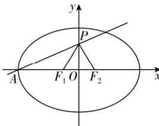

> [!faq]- 答案与解析
>
> > [!success]- **【答案】** $\frac{1}{4}$
>
> > [!note]- **【解析】**
> > 由 $|PF_{2}| = |F_{1}F_{2}|$ ，且 $\angle F_{1}PF_{2} = 60^{\circ}$ ，得 $\triangle F_{1}PF_{2}$ 为等边三角形，则点 $P$ 在线段 $F_{1}F_{2}$ 的垂直平分线上，即 $y$ 轴上，令椭圆半焦距为 $c$ ，则 $P(0, \sqrt{3} c)$ ，而点 $A(-a, 0)$ ，且直线 $AP$ 的斜率为 $\frac{\sqrt{3}}{4}$ ，因此 $\frac{\sqrt{3}c}{a} = \frac{\sqrt{3}}{4}$ ，所以 $C$ 的离心率 $e = \frac{c}{a} = \frac{1}{4}$ .
> >
> > 
