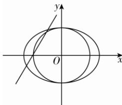

> [!faq]- 答案与解析
>
> > [!success]- **【答案】** B
>
> > [!note]- **【解析】**
> > B 【解析】因为以原点为圆心，椭圆 $C: \frac{x^{2}}{9} + \frac{y^{2}}{b^{2}} = 1 (b > 0)$ 短半轴长为半径的圆与直线 $y = \sqrt{3}x + 4$ 相交，所以 $\frac{4}{\sqrt{(\sqrt{3})^{2} + (-1)^{2}}} < b$ ，解得 b > 2。又椭圆
> >
> > → 点悟：圆心到直线的距离小于半径
> >
> > 焦点在 x 轴上，则 b < a = 3，故 2 < b < 3，则椭圆 C 的离心率 $e = \frac{\sqrt{a^{2} - b^{2}}}{a} = \frac{\sqrt{9 - b^{2}}}{3} \in \left(0, \frac{\sqrt{5}}{3}\right)$ 。故选 B.
> >
> > 
