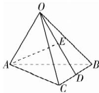

> [!faq]- 答案与解析
>
> > [!success]- **【答案】** A
>
> > [!note]- **【解析】**
> > A 【解析】如图, $\overrightarrow{AE}=\overrightarrow{AO}+\overrightarrow{OE}=$ $\overrightarrow{AO}+\frac{1}{2}\overrightarrow{OD}=\overrightarrow{AO}+\frac{1}{2}\times\frac{1}{2}(\overrightarrow{OB}+$
> >
> > 
> >
> > $\overrightarrow{OC}) = -a + \frac{1}{4} b + \frac{1}{4} c.$ 故选A.
> >
> > 名师点拨 对空间向量进行线性运算时,要尽可能地使空间向量转化为平行四边形或三角形中的向量,运用向量加法的平行四边形法则、三角形法则,利用三角形的中位线、相似三角形等平面几何性质,把未知向量转化为与已知向量有直接关系的向量进行运算.
