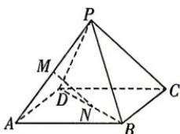

<!-- question-source:start -->
10. [四川眉山 2025 高二联考] 在正四棱锥 $P - ABCD$ 中, $PA = AB$ , $M$ 为 $PA$ 的中点, $\overrightarrow{BD} = \mu \overrightarrow{BN} (\mu > 1)$ . 若 $MN \perp AD$ , 则 $\mu =$ ( )

A. 2 B. 3 C. 4 D. 5
<!-- question-source:end -->
