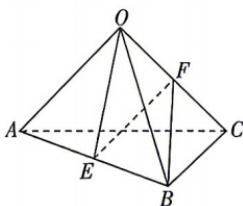

<!-- question-source:start -->
11.[广西玉林五校2026高二联考]如图,已知棱长为1的正四面体OABC,E,F分别是AB,OC的中点.

(1)用 $\overrightarrow{OA},\overrightarrow{OB},\overrightarrow{OC}$ 表示向量 $\overrightarrow{EF}$ ;

(2) 求证: $EF \perp AB, EF \perp OC.$

## 题型5 利用数量积求向量的模
<!-- question-source:end -->
