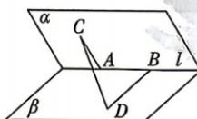

<!-- question-source:start -->
14.[北京人大附中2025高二月考]如图,二面角 $\alpha-l-\beta$ 的大小为 $\frac{\pi}{3}$ ,棱l上有A,B

两点,线段 $AC \subset \alpha, AC \perp l, BD \subset \beta, BD \perp l.$ 若 AC = 3, BD = 4, CD = 7, 则线段 AB 的长为 ( )
A. 5 B. 6 C. 7 D. 8
<!-- question-source:end -->
