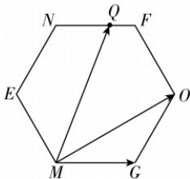

> [!faq]- 答案与解析
>
> > [!success]- **【答案】** C
>
> > [!note]- **【解析】**
> > C 【解析】对于 A, 设 $3a - b = x_{1}(3c + b) + y_{1}(a + c)$ ，则 $\left\{\begin{aligned}3 &= y_{1}, \\ -1 &= x_{1}, \\ 0 &= 3x_{1} + y_{1},\end{aligned}\right.$ 解得 $\left\{\begin{aligned}x_{1} &= -1, \\ y_{1} &= 3,\end{aligned}\right.$ 所以 $3a - b, 3c + b, a + c$ 共面，不能构成空间的一个基底，A 不正确；对于 B, 设 $a + b = x_{2}(3b + c) + y_{2}(3a - c)$ ，则 $\left\{\begin{aligned}1 &= 3y_{2}, \\ 1 &= 3x_{2}, \\ 0 &= x_{2} - y_{2},\end{aligned}\right.$ 解得 $x_{2} = y_{2} = \frac{1}{3}$ ，所以 $a + b, 3b + c, 3a - c$ 共面，不能构成空间的一个基底，B 不正确；对于 C, 设 $a + b + c = x_{3}(a + b) + y_{3}(b + c)$ ，所以 $\left\{\begin{aligned}1 &= x_{3}, \\ 1 &= x_{3} + y_{3}, \\ 1 &= y_{3}\end{aligned}\right.$ 此时无解，所以 $a + c$
> >
> > 为 $2\sqrt{2}$ 所以点 $Q$ 的轨迹围成图形的面积 $S = 6 \times \frac{1}{2} \times 2\sqrt{2} \times 2\sqrt{2} \times \sin 60^{\circ} = 12\sqrt{3}$ . (2) 如图, 根据向量数量积的几何意义可得, 当点 $Q$ 位于点 $O$ 时, $\overrightarrow{MG} \cdot \overrightarrow{MQ}$ 最大, 故 $\overrightarrow{MG} \cdot \overrightarrow{MQ} = |\overrightarrow{MG}| |\overrightarrow{MQ}| \cos \angle QMG = 2\sqrt{2} \times |\overrightarrow{MQ}| \cos \angle QMG \leqslant 2\sqrt{2} \times |\overrightarrow{MO}| \cdot \overrightarrow{MQ}$ 在 $\overrightarrow{MG}$ 上投影向量的长度 $\cos 30^{\circ} = 2\sqrt{2} \times 2\sqrt{6} \times \cos 30^{\circ} = 12$ , 所以 $\overrightarrow{MG} \cdot \overrightarrow{MQ}$ 的最大值为 12.
> >
> > 
> >
> > ## 刷素养
