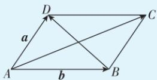
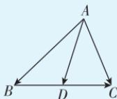

> [!faq]- 答案与解析
>
> > [!success]- **【答案】** D
>
> > [!note]- **【解析】**
> > D 【解析】 $\overrightarrow{MA} \cdot \overrightarrow{MB} = (\overrightarrow{MO_{1}} + \overrightarrow{O_{1}A}) \cdot (\overrightarrow{MO_{1}} + \overrightarrow{O_{1}B}) = \overrightarrow{MO_{1}^{2}} - \overrightarrow{O_{1}A^{2}} =$ $\left|\overrightarrow{MO_{1}}\right|^{2}-2^{2}\geqslant4^{2}-2^{2}=12$ ，当且仅当点M与点O重合时，等号成立，故 $\overrightarrow{MA}\cdot\overrightarrow{MB}$ 的最小值为12.故选D.
> > 多种解法 $\because O_{1}$ 为线段 AB 的中点, $\therefore \overrightarrow{MA} \cdot \overrightarrow{MB} = \frac{1}{4} \times \left[ (2 \overrightarrow{MO_{1}})^{2} - \overrightarrow{AB^{2}} \right] = \frac{1}{4} \times (4 \left| \overrightarrow{MO_{1}} \right|^{2} - \left| \overrightarrow{AB} \right|^{2}) = \left| \overrightarrow{MO_{1}} \right|^{2} - 4$ , 当点 M 与点 O 重合时, $\left| \overrightarrow{MO_{1}} \right|$ 取得最小值, 此时 $\left| \overrightarrow{MO_{1}} \right| = 4, \therefore (\overrightarrow{MA} \cdot \overrightarrow{MB})_{\min} = 4^{2} - 4 = 12.$ 故选 D.
> >
> > ## 二级结论 极化恒等式
> >
> > (1)根据向量的数量积运算,对任意向量 a, b, 有 $a \cdot b = \frac{1}{4} \left[ (a + b)^{2} - (a - b)^{2} \right]$ , 则在平行四边形 ABCD 中, $\overrightarrow{AB} \cdot \overrightarrow{AD} = \frac{1}{4} (\overrightarrow{AC^{2}} - \overrightarrow{BD^{2}})$ .
> >
> > 
> >
> > (2)在三角形 $ABC$ 中，若 $D$ 为 $BC$ 边的中点，则 $\overrightarrow{AB} \cdot \overrightarrow{AC} = \frac{1}{4}[(2\overrightarrow{AD})^2 - \overrightarrow{BC}^2]$ .
> >
> > 
