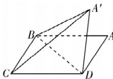

> [!faq]- 答案与解析
>
> > [!success]- **【答案】** ABD
>
> > [!note]- **【解析】**
> > ABD 【解析】如图所示. 对于 A, 因为 $BC \perp BD$ , 所以当平面 $A'BD \perp$ 平面
> >
> > 
> >
> > BCD 时, 平面 $A' BD \cap$ 平面 $BCD = BD$ , $BC \subset$ 平面 $BCD$ , 所以 $BC \perp$ 平面 $A' BD$ , 又 $A'B \subset$ 平面 $A' BD$ , 所以 $BC \perp A'B$ , 此时 $\overrightarrow{A'B} \cdot \overrightarrow{BC} = 0$ , A 符合题意; 对于 B, 由 $AB = 2$ , $BD = 1$ , $BD \perp BC$ , 可得 $\angle ABD = 60^\circ > 45^\circ$ , 则在翻折过程中, $\angle A' BA$ 会超过 $90^\circ$ , 故存在 $\angle A' BA =$ 点悟: $\triangle ABD$ 沿 $BD$ 翻折 $180^\circ$ 时, $\angle A' BA = 2\angle ABD = 2\times 60^\circ > 2\times 45^\circ = 90^\circ$ $90^\circ$ , 因为 $AB // CD$ , 所以直线 $CD$ 与直线 $A'B$ 有可能垂直, 此时 $\overrightarrow{A'B} \cdot \overrightarrow{CD} = 0$ , B 符合题意; 对于 C, 由题意得 $CD = AB = 2$ , $A'D = AD = \sqrt{3}$ , 则在 $\triangle A' CD$ 中, $CD > A'D$ , 所以 $\angle A' CD$ 为锐角, 故 $\overrightarrow{A'C} \cdot \overrightarrow{CD}$ 不可能为 0, C 不符合题意; 对于 D, 易知 $\angle ADB = 90^\circ$ , 将三角形 $ABD$ 沿着 $BD$ 翻折 $180^\circ$ 时, $A, D, A'$ 三点共线, 且四边形 $A'CBD$ 为矩形, 所以 $A'C \perp AD$ , 此时 $\overrightarrow{A'C} \cdot \overrightarrow{AD} = 0, D$ 符合题意.
> >
> > 故选 **ABD**.
