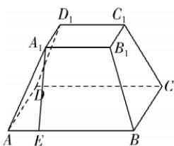

> [!faq]- 答案与解析
>
> > [!success]- **【答案】** A
>
> > [!note]- **【解析】**
> > A 【解析】如图，在正四棱台 $ABCD - A_1B_1C_1D_1$ 中，过点 $A_{1}$ 向 $AB$ 作垂线，垂足为点 $E$ 则 $AE = AA_{1}\cos \angle BAA_{1} = \frac{\sqrt{2}}{4}$ 所以 $\vert \overrightarrow{A_1B_1}\vert = \sqrt{2} -2\times \frac{\sqrt{2}}{4} = \frac{\sqrt{2}}{2},$ 所以 $\overrightarrow{AC_1}^2 = (\overrightarrow{AA_1} +\overrightarrow{A_1B_1} +\overrightarrow{B_1C_1})^2$ $= |\overrightarrow{AA_1}|^2 +|\overrightarrow{A_1B_1}|^2 +|\overrightarrow{B_1C_1}|^2 +2\overrightarrow{AA_1}\cdot$ $\overrightarrow{A_1B_1} +2\overrightarrow{A_1B_1}\cdot \overrightarrow{B_1C_1} +2\overrightarrow{AA_1}\cdot \overrightarrow{B_1C_1}$ $= 1 + \frac{1}{2} +\frac{1}{2} +\frac{1}{2} +0 + \frac{1}{2} = 3,$ 即 $\vert \overrightarrow{AC_1}\vert = \sqrt{3}.$ 故选A.
> >
> > 
