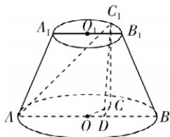

> [!faq]- 答案与解析
>
> > [!success]- **【答案】** C
>
> > [!note]- **【解析】**
> > C 【解析】如图, 取 $C_{1}$ 在下底面的射影点 C, 作 $CD \perp AB$ , 垂足为 D.
> >
> > 连接 $CO, CC_{1}, C_{1}D$ , 则 $\angle COD = \frac{\pi}{3}$ ,
> >
> > 点悟: $\angle COD = \angle C_{1}O_{1}B_{1} = \frac{\pi}{3}$ 因为 $CC_{1} \perp$ 平面 ACD, $AD \subset$ 平面 ACD, 所以 $CC_{1} \perp AD$ , 又 $CD \perp AD$ , $CC_{1} \cap CD = C$ , $CC_{1}$ , $CD \subset$ 平面 $CDC_{1}$ , 所以 $AD \perp$ 平面 $CDC_{1}$ .
> >
> > 又 $C_{1}D \subset$ 平面 $CDC_{1}$ , 所以 $AD \perp C_{1}D$ , 故 $\overrightarrow{AC_{1}}$ 在 $\overrightarrow{AB}$ 上的投影向量是 $\overrightarrow{AD}$ .
> >
> > 设上底面的半径为 r, 则 AB = 4r, $OD = \frac{1}{2}r$ , 则 $AD = AO + OD = 2r + \frac{1}{2}r = \frac{5}{2}r = \frac{5}{8}AB$ . 故 $\overrightarrow{AC_{1}}$ 在 $\overrightarrow{AB}$ 上的投影向量是 $\frac{5}{8}\overrightarrow{AB}$ . 故选 C.
> >
> > 
> >
> > ## 刷提升
