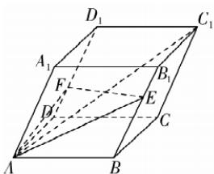

> [!faq]- 答案与解析
>
> > [!success]- **【答案】** D
>
> > [!note]- **【解析】**
> > D 【解析】对于选项 A: 点 P 关于坐标原点对称的点的坐标为 $(1, -1, -2)$ ，故 A 正确；
> > 对于选项 B: 点 P 关于 Oxy 平面对称的点的坐标为 $(-1, 1, -2)$ ，故 B 正确；
> > 对于选项 C: 点 P 在 Oyz 平面上的射影点的坐标为 $(0, 1, 2)$ ，故 C 正确；
> > 对于选项 D: 点 P 在 x 轴上的射影点的坐标为 $(-1, 0, 0)$ ，故 D 错误. 故选 D.
> >
> > 
> >
> > $\overrightarrow{EF} = \overrightarrow{AF} - \overrightarrow{AE} = \overrightarrow{AD} + \frac{1}{3}\overrightarrow{DD_1} - \overrightarrow{AB} - \frac{2}{3}\overrightarrow{BB_1} = -\overrightarrow{AB} + \overrightarrow{AD} - \frac{1}{3}\overrightarrow{AA_1},$ 则 $\overrightarrow{EF^2} = \overrightarrow{AB^2} + \overrightarrow{AD^2} + \frac{1}{9}\overrightarrow{AA_1^2} - 2\overrightarrow{AB}\cdot$ $\overrightarrow{AD} +\frac{2}{3}\overrightarrow{AB}\cdot \overrightarrow{AA_1} -\frac{2}{3}\overrightarrow{AD}\cdot \overrightarrow{AA_1}$ $= 4 + 4 + \frac{4}{9} -2\times 2\times 2\cos \frac{\pi}{3} +\frac{2}{3}\times 2\times$ $2\cos \frac{\pi}{3} -\frac{2}{3}\times 2\times 2\cos \frac{\pi}{3} = \frac{40}{9},$ 故 $|\overrightarrow{EF}| = \frac{2\sqrt{10}}{3}.\overrightarrow{AC_1} = \overrightarrow{AB} +\overrightarrow{AD} +\overrightarrow{AA_1},$ 故 $\overrightarrow{AC_1^2} = \overrightarrow{AB^2} +\overrightarrow{AD^2} +\overrightarrow{AA_1^2} +2\overrightarrow{AB}\cdot \overrightarrow{AD}+$ $2\overrightarrow{AB}\cdot \overrightarrow{AA_1} +2\overrightarrow{AD}\cdot \overrightarrow{AA_1} = 4 + 4 + 4 + 2\times 2\times$ $2\times \frac{1}{2} +2\times 2\times 2\times \frac{1}{2} +2\times 2\times 2\times \frac{1}{2} =$ $24,$ 故 $|\overrightarrow{AC_1}| = 2\sqrt{6},$ 则 $\frac{\overrightarrow{AC_1}\cdot\overrightarrow{EF}}{|\overrightarrow{AC_1}||\overrightarrow{EF}|}$ $= \frac{(\overrightarrow{AB} + \overrightarrow{AD} + \overrightarrow{AA_1})\cdot\left(-\overrightarrow{AB} +\overrightarrow{AD} -\frac{1}{3}\overrightarrow{AA_1}\right)}{2\sqrt{6}\times\frac{2\sqrt{10}}{3}}$ $= \frac{\sqrt{15}}{40}\times \left(-\overrightarrow{AB^2} +\overrightarrow{AD^2} -\frac{1}{3}\overrightarrow{AA_1^2}-$ $\frac{4}{3}\overrightarrow{AB}\cdot \overrightarrow{AA_1} +\frac{2}{3}\overrightarrow{AD}\cdot \overrightarrow{AA_1})$ $= -\frac{\sqrt{15}}{15},$ 故直线 $AC_{1}$ 与 $EF$ 所成角的余弦值为 $\frac{\sqrt{15}}{15}.$
