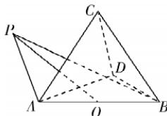

> [!faq]- 答案与解析
>
> > [!success]- **【答案】** BC
>
> > [!note]- **【解析】**
> > AD 【解析】若 $\{a, b, c\}$ 是单位正交基底，则 $|a| = |b| = |c| = 1$ ，且 $a \cdot b = 0, b \cdot c = 0, a \cdot c = 0$ ，
> > 所以 $\left|p\right|=\sqrt{\left(a+b+c\right)^{2}}$ $=\sqrt{a^{2}+b^{2}+c^{2}+2a\cdot b+2b\cdot c+2a\cdot c}$ $=\sqrt{1+1+1}=\sqrt{3}$ ，故 A 正确；
> >
> > $2|\overrightarrow{PO}|=|\overrightarrow{PA}+\overrightarrow{PB}|.$ 又 $|\overrightarrow{PB}+\overrightarrow{PA}|=2$ ，所以 $|\overrightarrow{PO}|=1$ ，
> > 即点 P 在以 O 为球心，1 为半径的球面上.
> >
> > 
> >
> > 因为 $\overrightarrow{AP} = \overrightarrow{AO} +\overrightarrow{OP}$ ，所以 $\overrightarrow{AP}\cdot \overrightarrow{AD} =$ $(\overrightarrow{AO} +\overrightarrow{OP})\cdot \overrightarrow{AD} = \overrightarrow{AO}\cdot \overrightarrow{AD} +\overrightarrow{OP}\cdot \overrightarrow{AD}.$ 由正四面体ABCD的棱长为 $2\sqrt{2}$ ，得 $AO = \sqrt{2}$ 所以 $\overrightarrow{AO}\cdot \overrightarrow{AD} = |\overrightarrow{AO} ||\overrightarrow{AD} |\cos 60^{\circ} =$ $\sqrt{2}\times 2\sqrt{2}\times \frac{1}{2} = 2.$ 设 $\langle \overrightarrow{OP},\overrightarrow{AD}\rangle = \theta$ ，则 $\overrightarrow{AP}\cdot \overrightarrow{AD} = \overrightarrow{AO}$ · $\overrightarrow{AD} +\overrightarrow{OP}\cdot \overrightarrow{AD} = 2 + |\overrightarrow{OP} ||\overrightarrow{AD} |\cos \theta = 2+$ $2\sqrt{2}\cos \theta .$ 又- $1\leqslant \cos \theta \leqslant 1$ ，所以 $2 - 2\sqrt{2}\leqslant 2+$ $2\sqrt{2}\cos \theta \leqslant 2 + 2\sqrt{2}$ ，即 $\overrightarrow{AP}\cdot \overrightarrow{AD}$ 的最大值为 $2 + 2\sqrt{2}$ ，最小值为 $2 - 2\sqrt{2}$ .故选BC.
> >
> > $\{a,b,c\}$ 是空间向量的一个基底,则 a,b,c 不共面,所以不存在唯一的有序实数对 $(x,y)$ ,使得 $c=xa+yb$ ,故 B 错误;
> > 若 $a \cdot b = 0, b \cdot c = 0$ ,则 $a \cdot c = 0$ 或 a 与 c 既不平行也不垂直,故 C 错误;
> > 设 $a + b = \lambda(b + c) + \mu(c + a)(\lambda, \mu \in R)$ , 则 $\begin{cases}\mu=1, \\ \lambda=1, \\ \lambda+\mu=0,\end{cases}$ 无解,所以不存在 $\lambda, \mu \in R$ ,使得 $a+b=\lambda(b+c)+\mu(a+c)$ ,所以 $a+b,b+c,c+a$ 不共面,能构成空间向量的一个基底,故 D 正确.
> >
> > 故选 **AD**.
