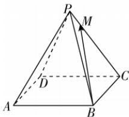

> [!faq]- 答案与解析
>
> > [!success]- **【答案】** D
>
> > [!note]- **【解析】**
> > D 【解析】由题意 $\overrightarrow{BM} = \overrightarrow{BC} + \overrightarrow{CM} = \overrightarrow{AD} + \frac{4}{5}\overrightarrow{CP} = \overrightarrow{AD} + \frac{4}{5}\left(\overrightarrow{AP} - \overrightarrow{AC}\right) = \overrightarrow{AD} + \frac{4}{5}\left[\overrightarrow{AP} - (\overrightarrow{AB} + \overrightarrow{AD})\right] = \boldsymbol{b} + \frac{4}{5}\left(\boldsymbol{c} - \boldsymbol{a} - \boldsymbol{b}\right) = -\frac{4}{5}\boldsymbol{a} + \frac{1}{5}\boldsymbol{b} + \frac{4}{5}\boldsymbol{c}.$ 故选 D.
> >
> > 
> >
> > 名师点拨 (1) 用已知向量来表示未知向量, 一定要结合图形.
> > (2)要正确理解向量加法、减法与数乘运算的几何意义.
> > (3)在空间中,向量加法的三角形法则、平行四边形法则仍然适用.
