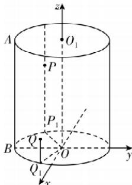

> [!faq]- 答案与解析
>
> > [!success]- **【答案】** B
>
> > [!note]- **【解析】**
> > B 【解析】设圆柱的上、下底面的圆心分别为 $O_{1}, O$ ，连接 $OO_{1}$ ，以 $OO_{1}$ 所在直线为 z 轴，BO 所在直线为 y 轴，建立如图所示的空间直角坐标系，过 Q 向圆 O 所在平面作垂线，垂足为 $Q_{1}$ ，连接 $OQ_{1}$ ，设圆 O 的半径为 r，则 $2\pi r = 12\pi$ ，所以 r = 6。设 $\angle BOQ_{1} = \alpha$ ，所以圆弧 $BQ_{1}$ 的长度为 $\alpha \times 6 = 2\pi$ ，所以 $\alpha = \frac{\pi}{3}$ ，则 $Q_{1}(3\sqrt{3})$ ，
> >
> > 敲黑板：弧长公式的应用
> >
> > -3,0), $Q(3\sqrt{3}, -3, 4)$ 。同理，过 P 向圆 O 所在平面作垂线，垂足为 $P_{1}$ ，连接 $OP_{1}$ ，则 $P_{1}(-3\sqrt{3}, -3, 0)$ ， $P(-3\sqrt{3}, -3, 10)$ ，所以 $PQ = \sqrt{(-3\sqrt{3} - 3\sqrt{3})^{2} + (-3 + 3)^{2} + (10 - 4)^{2}} = 12$ 。故选 B.
> >
> > 
