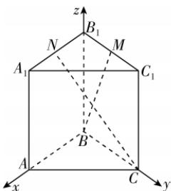

> [!faq]- 答案与解析
>
> > [!success]- **【答案】** A
>
> > [!note]- **【解析】**
> > A 【解析】由题意可知 BA, BC, $BB_{1}$ 两两垂直, 故分别以直线 BA, BC, $BB_{1}$ 为 x, y, z 轴建立如图所示的空间直角坐标系,
> >
> > 
> >
> > 则 $B(0,0,0),C(0,2,0),M(0,1,$ $2\sqrt{2}),N(1,0,2\sqrt{2})$ ，所以 $\overrightarrow{BM} =$ $(0,1,2\sqrt{2}),\overrightarrow{CN} = (1, - 2,2\sqrt{2}).$ 设直线 $BM$ 与直线 $CN$ 所成角为$\theta$ ，则 $\cos \theta = |\cos \langle \overrightarrow{BM},\overrightarrow{CN}\rangle | =$ $\frac{|\overrightarrow{BM}\cdot\overrightarrow{CN}|}{|\overrightarrow{BM}||\overrightarrow{CN}|} = \frac{6}{3\times\sqrt{13}} = \frac{2\sqrt{13}}{13},$ 所以直线 $BM$ 与直线 $CN$ 所成角的余弦值为 $\frac{2\sqrt{13}}{13}$ .
> >
> > 故选 **A**.
