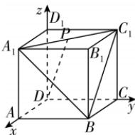

> [!faq]- 答案与解析
>
> > [!success]- **【答案】** D
>
> > [!note]- **【解析】**
> > D 【解析】设正方体的棱长为 1，且 $\overrightarrow{A_{1}P} = \lambda \overrightarrow{A_{1}C_{1}} (0 \leqslant \lambda \leqslant 1)$ ，以点 D 为原点，DA, DC, $DD_{1}$ 所在的直线分别为
> >
> > 
> >
> > x,y,z轴,建立空间直角坐标系,如图所示,则 $D(0,0,0)$ , $A_{1}(1,0,1)$ , $B(1,1,0)$ , $C_{1}(0,1,1)$ , 则 $\overrightarrow{A_{1}C_{1}} = (-1,1,0)$ , $\overrightarrow{A_{1}B} = (0,1,-1)$ , 由 $\overrightarrow{A_{1}P} = \lambda\overrightarrow{A_{1}C_{1}}$ 知 $P(1-\lambda,\lambda,1)$ , 则 $\overrightarrow{DP} = (1-\lambda,\lambda,1)$ .
> >
> > [122]
> >
> > a, 得 $x = \sqrt{3}$ , $y = 2\sqrt{3}a - 3$ ，所以平面 BCQ 的一个法向量为 $m = (\sqrt{3}, 2\sqrt{3}a - 3, a)$ .
> > 易知平面 ABP 的一个法向量为 $n = (0, 1, 0)$ ,
> > 因为平面 ABP 和平面 BCQ 夹角的正弦值为 $\frac{\sqrt{10}}{5}$ ，所以 $\left|\cos\left\langle m,n\right\rangle\right|=\sqrt{1-\left(\frac{\sqrt{10}}{5}\right)^{2}}=\frac{\sqrt{15}}{5}$ 所以 $\left|\cos\left\langle m,n\right\rangle\right|=\frac{\left|m\cdot n\right|}{\left|m\right|\left|n\right|}=\frac{\left|2\sqrt{3}a-3\right|}{\sqrt{3+\left(2\sqrt{3}a-3\right)^{2}+a^{2}}}=\frac{\sqrt{15}}{5}$ ，解得 $a=\sqrt{3}$ （舍去）或 $a=\frac{\sqrt{3}}{7}$ ，
> > → 遗坑：要根据动点在线段内运动舍掉不合题意的值
> > 即当 $\frac{AQ}{QP}=\frac{1}{6}$ 时，平面ABP和平面BCQ夹角的正弦值为 $\frac{\sqrt{10}}{5}$ .
> >
> > ## 刷素养
