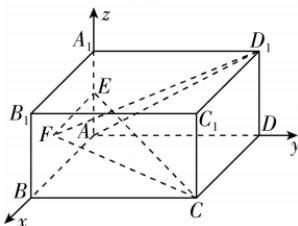

> [!faq]- 答案与解析
>
> > [!success]- **【答案】** BD
>
> > [!note]- **【解析】**
> > BD 【解析】以 A 为原点, 分别以 AB, AD, $AA_{1}$ 所在的直线为 x 轴、y 轴、z 轴建立如图所示的空间直角坐标系,
> >
> > 
> >
> > 则 $A(0,0,0)$ , $C(4,4,0)$ , $D_{1}(0,4,2)$ , $E(0,0,1)$ , $F(m,0,n)$ ( $m \in [0,$
> >
> > 4], $n \in [0,2]$ ，
> > 对于选项 A，若 $FC \perp FD_1$ ，则 $\overrightarrow{FC} \cdot \overrightarrow{FD_1} = 0$ ，又 $\overrightarrow{FC} = (4 - m, 4, -n), \overrightarrow{FD_1} = (-m, 4, 2 - n)$ ，所以 $(4 - m, 4, -n) \cdot (-m, 4, 2 - n) = 0$ ，即 $(m - 2)^2 + (n - 1)^2 + 11 = 0$ ，此方程无解，所以不存在点 F，使得 $FC \perp FD_1$ ，故 A 错误；
> > 对于选项 B，由 $FC = FD_1$ ，得 $\sqrt{(4 - m)^2 + 4^2 + (-n)^2} = \sqrt{(-m)^2 + 4^2 + (2 - n)^2}$ ，化简可得 $2m - n = 3$ ，即 F 点轨迹为矩形 $ABB_1A_1$ 内的线段，又 $n \in [0, 2]$ ，所以当 $n = 0$ 时，得 $F_1\left(\frac{3}{2}, 0, 0\right)$ ，当 $n = 2$ 时，得 $F_2\left(\frac{5}{2}, 0, 2\right)$ ，即满足 $FC = FD_1$ 的点 F 的轨迹长度为 $F_1F_2 = \sqrt{\left(\frac{5}{2} - \frac{3}{2}\right)^2 + 2^2} = \sqrt{5}$ ，故 B 正确；
> > 对于选项 C，设点 C 关于平面 $AA_1B_1B$ 的对称点为 G，则 G 的坐标为 $(4, -4, 0)$ ，则 $FC + FD_1 = FG + FD_1 \geqslant GD_1 = \sqrt{(-4)^2 + 8^2 + 2^2} = 2\sqrt{21}$ ，当 F, G, D₁ 共线时取等号，故 C 错误；
> > 对于选项 D， $\overrightarrow{AD_1} = (0, 4, 2)$ ， $\overrightarrow{EF} = (m, 0, n - 1)$ ， $\overrightarrow{EC} = (4, 4, -1)$ ，设平面 EFC 的法向量为 $s = (x, y, z)$ ，则 $\begin{cases} s \cdot \overrightarrow{EF} = 0, \\ s \cdot \overrightarrow{EC} = 0, \end{cases}$ 即 $\begin{cases} mx + (n - 1)z = 0, \\ 4x + 4y - z = 0, \end{cases}$ 令 $x = n - 1$ ，则 $y = 1 - n - \frac{1}{4}m, z = -m$ ，
> > 所以平面 EFC 的一个法向量为 $s = (n - 1, 1 - n - \frac{1}{4}m, -m)$ ，因为 $AD_1 //$ 平面 EFC，所以 $\overrightarrow{AD_1} \cdot s = 0$ ，即 $3m + 4n - 4 = 0$ ，又点 $A(0, 0, 0)$ ，所以 $AF = \sqrt{m^2 + n^2} = \sqrt{m^2 + \left(1 - \frac{3}{4}m\right)^2} = \sqrt{\frac{25}{16}\left(m - \frac{12}{25}\right)^2 + \frac{16}{25}}$ ，当 $m = \frac{12}{25} \in [0, 4]$ 时， $AF$ 取得最小值 $\frac{4}{5}$ ，故 D 正确。
> >
> > 故选 **BD**.
