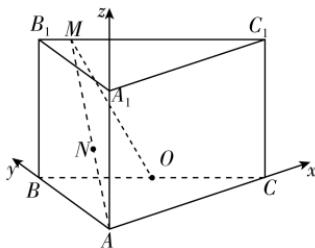

> [!faq]- 答案与解析
>
> > [!success]- **【答案】** $\left[\frac{3\sqrt{5}}{5}, \frac{5\sqrt{7}}{7}\right]$
>
> > [!note]- **【解析】**
> > 由题意，以 $A$ 为原点，以 $AC, AB, AA_1$ 所在直线分别为 $x, y, z$ 轴建立空间直角坐标系，如图所示，则 $A(0,0,0), O(1,1,0)$ ，设 $B_1M = a$ ，且 $0 \leqslant a \leqslant 2\sqrt{2}$ .
> >
> > 故 $M\left(\frac{a}{\sqrt{2}}, \frac{2\sqrt{2} - a}{\sqrt{2}}, \sqrt{3}\right)$ ,
> >
> > → 点悟：可由 $\overrightarrow{B_1M} = \frac{a}{2\sqrt{2}}\overrightarrow{B_1C_1}$ 求点 $M$ 的坐标
> >
> > 所以 $MO = \sqrt{\left(\frac{a}{\sqrt{2}} - 1\right)^{2} + \left(\frac{2\sqrt{2} - a}{\sqrt{2}} - 1\right)^{2} + 3}$ $= \sqrt{\frac{(a - \sqrt{2})^{2}}{2} + \frac{(\sqrt{2} - a)^{2}}{2} + 3}$ $= \sqrt{a^{2} - 2\sqrt{2}a + 5}$ MA = $\sqrt{\left(\frac{a}{\sqrt{2}}\right)^{2} + \left(\frac{2\sqrt{2} - a}{\sqrt{2}}\right)^{2} + 3}$ $= \sqrt{\frac{2a^{2} - 4\sqrt{2}a + 14}{2}} = \sqrt{a^{2} - 2\sqrt{2}a + 7}$ 因为 $\frac{MN}{MO} = \frac{MO}{MA}$ ，所以 $MN = \frac{MO^{2}}{MA} = \frac{a^{2} - 2\sqrt{2}a + 5}{\sqrt{a^{2} - 2\sqrt{2}a + 7}}$ ，令 t = $\sqrt{a^{2} - 2\sqrt{2}a + 7} = \sqrt{(a - \sqrt{2})^{2} + 5}$ 因为 $0 \leqslant a \leqslant 2\sqrt{2}$ ，所以 $\sqrt{5} \leqslant \sqrt{(a - \sqrt{2})^{2} + 5} \leqslant \sqrt{7}$ ，即 $t \in [\sqrt{5}, \sqrt{7}]$ 所以 $MN = \frac{a^{2} - 2\sqrt{2}a + 5}{\sqrt{a^{2} - 2\sqrt{2}a + 7}} = \frac{t^{2} - 2}{t} = t - \frac{2}{t}$ 因为函数 $y = t - \frac{2}{t}$ 在 $t \in [\sqrt{5}, \sqrt{7}]$ 上单调递增，
> >
> > 所以 $\sqrt{5} - \frac{2}{\sqrt{5}} \leqslant MN \leqslant \sqrt{7} - \frac{2}{\sqrt{7}}$ ，即 $\frac{3\sqrt{5}}{5} \leqslant MN \leqslant \frac{5\sqrt{7}}{7}$ 。故线段 MN 长度的取值范围为 $\left[\frac{3\sqrt{5}}{5}, \frac{5\sqrt{7}}{7}\right]$ 。
> >
> > 
