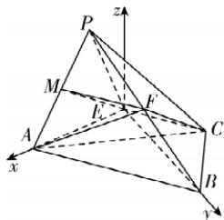

> [!faq]- 答案与解析
>
> > [!success]- **【答案】** (1)
>
> > [!note]- **【解析】**
> > 【证明】如图, 取 PA 的中点 M, 连接 ME, MF,
> > 由于 F 为 PB 的中点, 故 $MF \parallel AB$ 且 $MF = \frac{1}{2} AB$ .
> > 又 $EC \parallel AB$ 且 $EC = \frac{1}{2} AB$ ，故 $EC \parallel MF, EC = MF$ ,
> > 故四边形 ECFM 为平行四边形，故 $ME \parallel CF$ . 又 $ME \subset$ 平面 PAE, $CF \not\subset$ 平面 PAE,
> > 故 CF//平面 PAE.
> >
> > 
> >
> > (2)①【证明】如图,连接AC,BE.由于AB=2BC=2, $\angle ABC=60^{\circ}$ ,E为CD的中点,
> > 故 $AC=\sqrt{AB^{2}+BC^{2}-2AB\cdot BC\cos60^{\circ}}=\sqrt{4+1-2\times2\times1\times\frac{1}{2}}=\sqrt{3}$ ,
> > 所以 $AC^{2}+BC^{2}=AB^{2}$ ，故 $AC \perp BC$ 由于 $\angle ADC = 60^{\circ}, AD = DE = 1$ ，可知 $\triangle PAE$ 为等边三角形，
> > 又 $EC \parallel AB, AE = BC = 1$ ，故梯形 ABCE 为
> > 等腰梯形，因此 $AE \perp BE$ 且 AC = BE.
> > 由于 PB = 2, BE = AC = $\sqrt{3}$ , PE = 1, 故 $PE^{2} + EB^{2} = PB^{2}$ ，即 $PE \perp BE$ . 又 $PE \cap AE = E, PE, AE \subset$ 平面 PAE, 故 EB⊥平面 PAE. 又 EB⊂平面 ABCE,
> > 故平面 PAE⊥平面 ABCE.
> > - **②**：【解】以 E 为坐标原点， $\overrightarrow{EA},\overrightarrow{EB}$ 的方向分别为 x,y 轴的正方向，建立如图所示的空间直角坐标系，则 $E(0,0,0)$ , $A(1,0,0)$ , $B(0,\sqrt{3},0)$ , $C\left(-\frac{1}{2},\frac{\sqrt{3}}{2},0\right),P\left(\frac{1}{2},0,\frac{\sqrt{3}}{2}\right)$ ,
> > 则 $\overrightarrow{EC}=\left(-\frac{1}{2},\frac{\sqrt{3}}{2},0\right),\overrightarrow{EP}=\left(\frac{1}{2},0,\frac{\sqrt{3}}{2}\right)$ .
> > 设平面 PCE 的法向量为 $m=(x,y,z)$ ,
> > 则 $\left\{\begin{aligned}\overrightarrow{EC}\cdot\boldsymbol{m}&=-\frac{1}{2}x+\frac{\sqrt{3}}{2}y=0,\\ \overrightarrow{EP}\cdot\boldsymbol{m}&=\frac{1}{2}x+\frac{\sqrt{3}}{2}z=0,\end{aligned}\right.$ 取 $x=\sqrt{3}$ ，则 $m=(\sqrt{3},1,-1)$ .
> > 设 $\overrightarrow{PF}=n\overrightarrow{PB}, n\in(0,1]$ ，则 $\overrightarrow{PF}=n\overrightarrow{PB}=n\left(-\frac{1}{2},\sqrt{3},-\frac{\sqrt{3}}{2}\right)=\left(-\frac{1}{2}n,\sqrt{3}n,-\frac{\sqrt{3}}{2}n\right)$ ,
> > 则 $F\left(\frac{1}{2}-\frac{1}{2}n,\sqrt{3}n,\frac{\sqrt{3}}{2}-\frac{\sqrt{3}}{2}n\right)$ ,
> > 故 $\overrightarrow{EF}=\left(\frac{1}{2}-\frac{1}{2}n,\sqrt{3}n,\frac{\sqrt{3}}{2}-\frac{\sqrt{3}}{2}n\right)$ .
> > 因此点 F 到平面 PCE 的距离 d = $\frac{| \overrightarrow{EF} \cdot m |}{|m|}=$ 点悟：此处 $d=|\overrightarrow{EF}||\cos\langle\overrightarrow{EF},m\rangle|$ $\frac{\left|\left(\frac{1}{2}-\frac{1}{2}n\right)\times\sqrt{3}+\sqrt{3}n-\left(\frac{\sqrt{3}}{2}-\frac{\sqrt{3}}{2}n\right)\right|}{\sqrt{5}}=\frac{\sqrt{15}}{10}$ ，解得 $n=\frac{1}{2}$ （负值舍去），故 $\frac{PF}{PB}=n=\frac{1}{2}$ .
