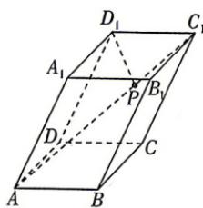

<!-- question-source:start -->
1.[湖北武汉多校2026高二期中联考]如图,平行六面体 $ABCD-A_{1}B_{1}C_{1}D_{1}$ 中,点P是线段 $AC_{1}$ 上的一点,且 $AP=2PC_{1}$ ,设 $\overrightarrow{AA_{1}}=a,\overrightarrow{AB}=b,\overrightarrow{AD}=c$ ,则 $\overrightarrow{PD_{1}}=$

A. $\frac{1}{3} a - \frac{2}{3} b + \frac{1}{3} c$ B. $\frac{1}{3} a - \frac{2}{3} b - \frac{1}{3} c$ C. $a - \frac{2}{3} b + \frac{1}{3} c$ D. $\frac{1}{3} a - \frac{2}{3} b + \frac{2}{3} c$

<!-- question-source:end -->
