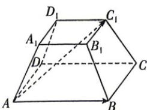
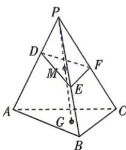

<!-- question-source:start -->
4.[宁夏银川二中2025高二月考]如图,正四棱台ABCD- $A_{1}B_{1}C_{1}D_{1}$ 中, $AB = 2$ , $A_{1}B_{1} = 1$ , 则 $\overrightarrow{AC_1}$ 在 $\overrightarrow{AB}$ 上的投影向

量是 （ ）
A. $\frac{3}{4}\overrightarrow{AB}$ B. $\frac{5}{6}\overrightarrow{AB}$ C. $\frac{3}{8}\overrightarrow{AB}$ D. $\frac{5}{8}\overrightarrow{AB}$ 建议用时:60 分钟 答案 P106

<!-- question-source:end -->
