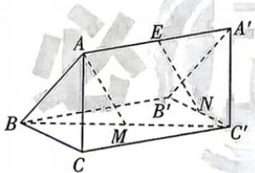

<!-- question-source:start -->
10.[山东枣庄滕州一中2026高二段考]如图,在空间中平移△ABC到△A'B'C',连接对应顶点,设 $\overrightarrow{AA'}=\boldsymbol{a},\overrightarrow{AB}=\boldsymbol{b},\overrightarrow{AC}=\boldsymbol{c},M,E$ 分别是线段BC',AA'的中点,N是线段B'C'上一点.
(1) 若 N 为线段 B'C' 的中点, 用向量法证明:
AM//EN;
(2) 若 AB = AC = 1, AA' = 2, ∠BAC = 60°, $\angle ACC' = \angle ABB' = 90^{\circ}$ , 判断是否存在点 N 使得 AM⊥EN, 并说明理由.

<!-- question-source:end -->
