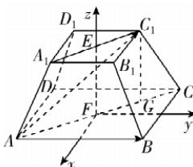

> [!faq]- 答案与解析
>
> > [!success]- **【答案】** B
>
> > [!note]- **【解析】**
> > A 【解析】如图，设正四棱台 $ABCD - A_1B_1C_1D_1$ 的高为 $h$ ，四边形 $ABCD, A_1B_1C_1D_1$ 是正方形，设其中心分别为 $F, E$ ，连接 $CA, C_1A_1, EF.$ 以 $F$ 为原点，过点 $F$ 垂直于 $AB$ 的直线为 $x$ 轴，过点 $F$ 垂直于 $BC$ 的直线为 $y$ 轴， $EF$ 所在直线为 $z$ 轴，建立空间直角坐标系，且作 $C_1G \perp CF$ ，垂足为 $G$ ，由勾股定理得 $CA = 2\sqrt{2}, C_1A_1 = \sqrt{2}$ ，所以 $CF = \sqrt{2}, C_1E = \frac{\sqrt{2}}{2}$ . 由题意得 $C_1E // CF, C_1G // EF$ ，所以四边形 $EFGC_1$ 是平行四边形，所以 $C_1E = GF = \frac{\sqrt{2}}{2}, EF = C_1G$ ，所以 $CG = \frac{\sqrt{2}}{2}$ ，所以 $C_1\left(-\frac{1}{2}, \frac{1}{2}, h\right)$ ，而 $A(1, -1, 0), B(1, 1, 0)$ ，所以 $\overrightarrow{AB} = (0, 2, 0), \overrightarrow{AC_1} = \left(-\frac{3}{2}, \frac{3}{2}, h\right)$ ，所以 $\overrightarrow{AB} \cdot \overrightarrow{AC_1} = 2 \times \frac{3}{2} = 3,$
> >
> > 1, 解得 $\lambda > -\frac{7}{8}$ 且 $\lambda \neq 7$ . 因为 $\left(-\frac{7}{8}, \right.$ 点悟：当 a 与 b 的夹角为 0 时，解得 $\lambda = 7$ $7)\cup(7,+\infty)$ 是 $\left(-\frac{7}{8},+\infty\right)$ 的真子集，
> > 所以“ $\lambda > -\frac{7}{8}$ ”是“a 与 b 的夹角为锐角”的必要不充分条件. 故选 B.
> >
> > 易错警示 当两个向量的夹角为锐角时,其数量积大于0;但当两个向量的数量积大于0时,两个向量的夹角可能为0.所以解决此类问题时,注意排除同向共线的情况.
> >
> > 故 $\overrightarrow{AC_1}$ 在 $\overrightarrow{AB}$ 上的投影向量为 $\frac{\overrightarrow{AB}\cdot\overrightarrow{AC_1}}{|\overrightarrow{AB}|}\cdot \frac{\overrightarrow{AB}}{|\overrightarrow{AB}|} = \frac{3}{4}\overrightarrow{AB}.$ 故选A.
> >
> > 
