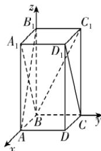

> [!faq]- 答案与解析
>
> > [!success]- **【答案】** BCD
>
> > [!note]- **【解析】**
> > BCD 【解析】以 B 为原点, 建立如图所示的空间直角坐标系, 得 $B(0,0,0)$ , $C(0,1,0)$ , $B_{1}(0,0,2)$ , $D_{1}(1,1,2)$ , 则 $\overrightarrow{BC}=(0,1,0)$ , $\overrightarrow{BB_{1}}=$
> >
> > 
> >
> > (0,0,2). 因为 $\overrightarrow{BP} = \lambda \overrightarrow{BC} +\mu \overrightarrow{BB_1}$ ，所以 $P(0,\lambda ,$ $2\mu)$ ，当 $\lambda = 1$ 时， $P(0,1,2\mu)$ ，因为 $\mu \in$ [0,1]，所以点 $P$ 在线段 $CC_{1}$ 上运动，
> >
> > 点悟：只有线段 $CC_{1}$ 上的点的横、纵坐标分别为0,1显然点 $P$ 到直线 $AB_{1}$ 的距离随着点 $P$ 位置的变化而变化，线段 $AB_{1}$ 的长度确定，故 $\triangle AB_{1}P$ 的面积不为定值，故A错误；当 $\mu = 1$ 时， $P(0,\lambda ,2),\lambda \in [0,1]$ ，故此时点 $P$ 在线段 $B_{1}C_{1}$ 上运动，由题可知，四边形 $A_{1}BCD_{1}$ 的面积为定值， $B_{1}C_{1} // BC$ ，显然 $B_{1}C_{1} \not\subset$ 平面 $A_{1}BCD_{1},BC \subset$ 平面 $A_{1}BCD_{1}$ ，故 $B_{1}C_{1} //$ 平面 $A_{1}BCD_{1}$ ，所以 $B_{1}C_{1}$ 到平面 $A_{1}BCD_{1}$ 的距离为定值，所以四棱锥 $P - A_{1}BCD_{1}$ 的体积为定值，故B正确；当 $\lambda = \mu$ 时， $\overrightarrow{BP} = \lambda \overrightarrow{BC} + \lambda \overrightarrow{BB_1} = \lambda \overrightarrow{BC_1},\lambda \in$ $[0,1]$ ，所以此时点 $P$ 的轨迹为线段 $BC_{1}$ ，易知 $BC_{1} = \sqrt{1 + 4} = \sqrt{5}$ ，故C正确；当 $\lambda +\mu = 1$ 时，此时 $P(0,1 - \mu ,2\mu)$ ，因为 $D_{1}(1,1,2)$ ，所以 $PD_{1} =$ $\sqrt{1 + \mu^{2} + (2 - 2\mu)^{2}} = \sqrt{5\mu^{2} - 8\mu + 5}$ .因为 $\mu \in [0,1]$ ，所以 $PD_{1} =$ $\sqrt{5\mu^{2} - 8\mu + 5}\in \left[\frac{3\sqrt{5}}{5},\sqrt{5}\right]$ ，故D正确.
> >
> > 故选 **BCD**.
