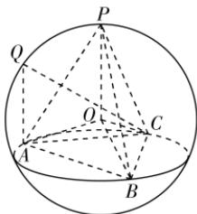
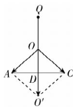

> [!faq]- 答案与解析
>
> > [!success]- **【答案】** $\frac{\sqrt{3} + 1}{2}$
>
> > [!note]- **【解析】**
> > 由题意, 如图①所示, 设点 $O$ 为正四面体 $PABC$ 的外接球球心,连接 OA, OB, OC, OP.
> >
> > 
> > 图①
> >
> > 则 $OA = OB = OC = OP = \frac{\sqrt{6}}{4} \times \sqrt{2} = \frac{\sqrt{3}}{2}$ , 且 $\overrightarrow{QA} \cdot \overrightarrow{QC} = (\overrightarrow{QO} + \overrightarrow{OA}) \cdot (\overrightarrow{QO} + \overrightarrow{OC}) = |\overrightarrow{QO}|^2 + \overrightarrow{QO} \cdot (\overrightarrow{OA} + \overrightarrow{OC}) + \overrightarrow{OA} \cdot \overrightarrow{OC} = \left(\frac{\sqrt{3}}{2}\right)^2 + \overrightarrow{QO} \cdot (\overrightarrow{OA} + \overrightarrow{OC}) + |\overrightarrow{OA}| |\overrightarrow{OC}| \cdot \cos \angle AOC = \frac{3}{4} + \overrightarrow{QO} \cdot (\overrightarrow{OA} + \overrightarrow{OC}) + |\overrightarrow{OA}| |\overrightarrow{OC}| \cdot \frac{OA^2 + OC^2 - AC^2}{2 |OA| \cdot |OC|} = \frac{3}{4} + \overrightarrow{QO} \cdot (\overrightarrow{OA} + \overrightarrow{OC}) + \frac{OA^2 + OC^2 - AC^2}{2} = \frac{3}{4} + \overrightarrow{QO} \cdot (\overrightarrow{OA} + \overrightarrow{OC}) + \frac{\left(\frac{\sqrt{3}}{2}\right)^2 + \left(\frac{\sqrt{3}}{2}\right)^2 - (\sqrt{2})^2}{2} = \frac{1}{2} + \overrightarrow{QO} \cdot (\overrightarrow{OA} + \overrightarrow{OC}).$
> >
> > 当 $\overrightarrow{QO}$ 与 $\overrightarrow{OA} + \overrightarrow{OC}$ 同向时， $\overrightarrow{QA} \cdot \overrightarrow{QC}$ 的值最大
> >
> > 点悟：两向量同向时夹角的余弦值为 1
> >
> > 设 $\overrightarrow{OA} + \overrightarrow{OC} = \overrightarrow{OO'}$ ，设 AC 的中点为 D，则 $OO'$ 过点 D，如图②所示。AD =
> >
> > 
> > 图②
> >
> > $CD=\frac{1}{2}AC=\frac{\sqrt{2}}{2},\therefore OD=\sqrt{AO^{2}-AD^{2}}=$ $\sqrt{\left(\frac{\sqrt{3}}{2}\right)^{2}-\left(\frac{\sqrt{2}}{2}\right)^{2}}=\frac{1}{2},OO^{\prime}=2OD=$ 1, 故 $(\overrightarrow{QA}\cdot\overrightarrow{QC})_{\max}=\frac{1}{2}+\frac{\sqrt{3}}{2}\times1\times$ $\cos0^{\circ}=\frac{\sqrt{3}+1}{2}.$
> >
> > 多种解法 取 $AC$ 的中点 $M$ , 正四面体 $PABC$ 的外接球球心为 $O$ , 连接 $OA, OM, QM$ , 则 $\overrightarrow{QA} \cdot \overrightarrow{QC} = (\overrightarrow{QM} + \overrightarrow{MA}) \cdot (\overrightarrow{QM} + \overrightarrow{MC}) = \left(\overrightarrow{QM} - \frac{1}{2}\overrightarrow{AC}\right) \cdot \left(\overrightarrow{QM} + \frac{1}{2}\overrightarrow{AC}\right) = \overrightarrow{QM}^2 - \frac{1}{4}\overrightarrow{AC}^2$ , 因为 $AC$ 长度是定值, 故当 $|\overrightarrow{QM}|$ 最大时, $\overrightarrow{QA} \cdot \overrightarrow{QC}$ 最大. 显然, 当 $Q$ 在 $MO$ 的延长线与球面的交点处时, $|\overrightarrow{QM}|$ 最大. 因为 $OA = \frac{\sqrt{6}}{4} \times \sqrt{2} = \frac{\sqrt{3}}{2}$ , 所以 $OM = \sqrt{OA^2 - \left(\frac{1}{2}AC\right)^2} = \frac{1}{2}$ ,
> >
> > 此时 $QM = OM + \frac{\sqrt{3}}{2} = \frac{1 + \sqrt{3}}{2}$ ，则 $(\overrightarrow{QA} \cdot \overrightarrow{QC})_{\max} = \left(\frac{1 + \sqrt{3}}{2}\right)^{2} - \frac{1}{4} \times (\sqrt{2})^{2} = \frac{\sqrt{3} + 1}{2}$ .
> >
> > 二级结论 棱长为 a 的正四面体, 其高为 $\frac{\sqrt{6}}{3}a$ , 外接球半径 $R=\frac{\sqrt{6}}{4}a$ , 内切球半径 $r=\frac{\sqrt{6}}{12}a$ .
