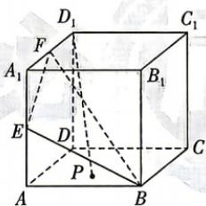

<!-- question-source:start -->
4.[山西太原五中2025高二月考]如图,已知正方体 $ABCD-A_{1}B_{1}C_{1}D_{1}$ 的棱长为2,E,F分别是棱 $AA_{1},A_{1}D_{1}$ 的中点,点P为底面ABCD

内(包括边界)的一动点,若直线 $D_{1}P$ 与平面 BEF 无公共点,则点 P 的轨迹长度为 ( )
A. $\sqrt{2}$ B. $\sqrt{5}$ C.2 D. $\sqrt{3}$
<!-- question-source:end -->
