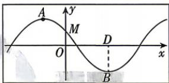
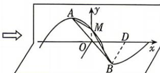

<!-- question-source:start -->
6. 新考向 模块融合 (多选) [辽宁沈阳 2026 高二月考] 如图①, 某同学在一张矩形卡片上绘制了函数 $f(x) = \sin \left( \pi x + \frac{5\pi}{6} \right)$ 的部分图象, $A, B$ 分别是函数 $f(x)$ 图象相邻的一个最高点和最低点, $M$ 是 $f(x)$ 图象与 $y$ 轴的交点, $BD \perp OD$ , 现将该卡片沿 $x$ 轴折成如图②所示的直二面角 $A-OD-B$ , 则在图②中, 下列结果正确的是 ( )

  
图①

  
图②

A. $AB = \sqrt{3}$

B. 点 D 到平面 ABM 的距离为 $\frac{\sqrt{14}}{14}$ C. 点 D 到直线 AB 的距离为 $\frac{\sqrt{3}}{3}$ D. 平面 OBD 与平面 ABM 夹角的余弦值为 $\frac{\sqrt{14}}{7}$
<!-- question-source:end -->
