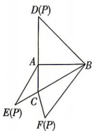

<!-- question-source:start -->
9.[湖南衡阳八中2026月考]如图,在三棱锥P-ABC的平面展开图中,AC=1,AB=AD= $\sqrt{3}$ ,AB⊥AC,AB⊥AD, $\angle CAE=30^{\circ}$ .

(1) 求 $\angle FCB$ 的余弦值.

(2)在三棱锥的棱 $AP$ 上是否存在点 $Q$ , 使得平面 $ABP$ 和平面 $BCQ$ 夹角的正弦值为 $\frac{\sqrt{10}}{5}$ ? 若存在, 求出 $\frac{AQ}{QP}$ 的值; 若不存在, 说明理由.

## 品

## 刷素养
<!-- question-source:end -->
