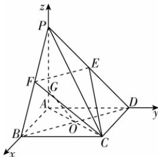

> [!faq]- 答案与解析
>
> > [!success]- **【答案】** D
>
> > [!note]- **【解析】**
> > D 【解析】∵ $PA \perp$ 平面 ABCD, AB, AD ⊂ 平面 ABCD, ∴ $PA \perp AB$ , $PA \perp AD$ . 又底面 ABCD 是正方形, ∴ $AB \perp AD$ , 则 PA, AB, AD 两两垂直, ∴ 以点 A 为坐标原点, $\overrightarrow{AB}$ , $\overrightarrow{AD}$ , $\overrightarrow{AP}$ 的方向分别为 x, y, z 轴的正方向建立空间直角坐标系如图所示, 由 PA = AB = 2, E, F 分别为 PD, PB 的中点, 得 O(1, 1, 0), C(2, 2, 0), E(0, 1, 1), F(1, 0, 1), 则 $\overrightarrow{EF} = (1, -1, 0)$ , $\overrightarrow{EC} = (2, 1, -1)$ . 设平面 EFC 的法向量为 $m = (x, y, z)$ , 则 $\left\{\begin{aligned}\overrightarrow{EF} \cdot m &= x - y = 0, \\ \overrightarrow{EC} \cdot m &= 2x + y - z = 0,\end{aligned}\right.$ 令 x = 1, 得 $m = (1, 1, 3)$ . 设 G(0, 0, a), 则 $\overrightarrow{OG} = (-1, -1, a)$ , ∵ OG // 平面 EFC, ∴ $\overrightarrow{OG} \perp m$ , ∴ $\overrightarrow{OG} \cdot m = 0$ , 即 $-1 \times 1 - 1 \times 1 + 3a = 0$ , 解得 $a = \frac{2}{3}$ , ∴ AG = $\frac{2}{3}$ . 故选 D.
> >
> > 
