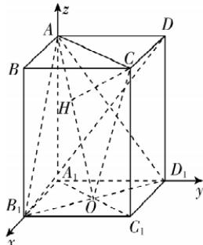

> [!faq]- 答案与解析
>
> > [!success]- **【答案】** A
>
> > [!note]- **【解析】**
> > A 【解析】如图，连接 $A_{1}C_{1}$ 交 $B_{1}D_{1}$ 于点 O，连接 AO, CO, AC，过点 C 作 $CH \perp AO$ 于点 H，易得平面 $AB_{1}D_{1} \perp$ 平面 $AA_{1}C_{1}C$ ，且平面 $AB_{1}D_{1} \cap$ 平面 $AA_{1}C_{1}C = AO, CH \subset$ 平面 $AA_{1}C_{1}C$ ，所以 $CH \perp$ 平面 $AB_{1}D_{1}$ ，则 $CH = \frac{4\sqrt{10}}{5}$ 。设 $AA_{1} = a (a > 0)$ ，则 $AO = CO = \sqrt{a^{2} + 2}, AC = 2\sqrt{2}$ ，则根据三角形面积公式得 $S_{\triangle AOC} = \frac{1}{2} \times AO \times CH = \frac{1}{2} \times AC \times AA_{1}$ ，将 $AA_{1} = a, AO = \sqrt{a^{2} + 2}, AC = 2\sqrt{2}, CH = \frac{4\sqrt{10}}{5}$ 代入解得 $a = 2\sqrt{2}$ （负值舍去）。
> > 以 $A_{1}$ 为坐标原点，建立如图所示的空
> >
> > 间直角坐标系 $A_{1}xyz$ .
> >
> > 
> >
> > 则 $A(0,0,2\sqrt{2}), B_1(2,0,0), D_1(0,2,0), D(0,2,2\sqrt{2})$ ，所以 $\overrightarrow{AD_1} = (0,2,-2\sqrt{2}), \overrightarrow{AB_1} = (2,0,-2\sqrt{2}), \overrightarrow{B_1D} = (-2,2,2\sqrt{2})$ . 设平面 $AB_1D_1$ 的法向量为 $\boldsymbol{n} = (x, y, z)$ ，则 $\left\{\begin{array}{l}\boldsymbol{n} \cdot \overrightarrow{AD_1} = 0, \\ \boldsymbol{n} \cdot \overrightarrow{AB_1} = 0,\end{array}\right.$ 即 $\left\{\begin{array}{l}2y - 2\sqrt{2}z = 0, \\ 2x - 2\sqrt{2}z = 0,\end{array}\right.$ 令 $x = \sqrt{2}$ ，得平面 $AB_1D_1$ 的一个法向量 $\boldsymbol{n} = (\sqrt{2}, \sqrt{2}, 1)$ . $\cos \langle \overrightarrow{B_1D}, \boldsymbol{n} \rangle = \frac{\overrightarrow{B_1D} \cdot \boldsymbol{n}}{|\overrightarrow{B_1D}| |\boldsymbol{n}|} = \frac{\sqrt{10}}{10}$ ，所以直线 $B_1D$ 与平面 $AB_1D_1$ 所成角的余弦值为 $\sqrt{1 - \left(\frac{\sqrt{10}}{10}\right)^2} = \frac{3\sqrt{10}}{10}$ ，
> >
> > 故选 **A**.
