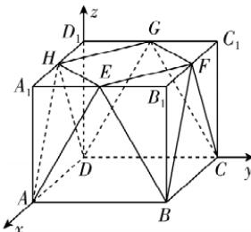

> [!faq]- 答案与解析
>
> > [!success]- **【答案】** A
>
> > [!note]- **【解析】**
> > A 【解析】如图, 把几何体补全为长方体 $ABCD-A_{1}B_{1}C_{1}D_{1}$ , 则 $A_{1}E=A_{1}H=\frac{1}{2}A_{1}B_{1}=10\ cm, AA_{1}=\sqrt{AE^{2}-A_{1}E^{2}}=10\sqrt{3}\ cm$ , 所以该包装盒的容积为 $V_{ABCD-A_{1}B_{1}C_{1}D_{1}}-4V_{A-A_{1}EH}=20\times20\times10\sqrt{3}-4\times\frac{1}{3}\times\frac{1}{2}\times10\times10\times10\sqrt{3}=\frac{10\ 000\sqrt{3}}{3}\ cm^{3}$ , 故②错误;
> >
> > 
> >
> > 以 D 为坐标原点，DA, DC, $DD_{1}$ 所在直线分别为 x, y, z 轴建立空间直角坐标系，则 A(20, 0, 0)，B(20, 20, 0)， $E(20, 10, 10\sqrt{3})$ ， $F(10, 20, 10\sqrt{3})$ ， $H(10, 0, 10\sqrt{3})$ ，可得 $\overrightarrow{EH} = (-10, -10, 0)$ ， $\overrightarrow{AE} = (0, 10, 10\sqrt{3})$ ， $\overrightarrow{BF} = (-10, 0, 10\sqrt{3})$ ，所以 $\overrightarrow{EH} \cdot \overrightarrow{BF} = 100$ ，故①正确；
> > 设平面 AEH 的法向量为 $n = (x, y, z)$ ，则 $\left\{\begin{aligned}\boldsymbol{n} & \cdot \overrightarrow{EH}=-10x-10y=0, \\ \boldsymbol{n} & \cdot \overrightarrow{AE}=10y+10\sqrt{3}z=0,\end{aligned}\right.$ 令 $x=\sqrt{3}$ ，则 $y=-\sqrt{3}, z=1$ ，可得 $n=(\sqrt{3},-\sqrt{3},1)$ ，由题意可知，上底面 HEFG 的一个法向量为 $m=(0,0,1)$ ，则 $\cos\langle m,n\rangle=\frac{m\cdot n}{|m||n|}=\frac{1}{\sqrt{7}\times1}=\frac{\sqrt{7}}{7}$ ，由图可知二面角 A-HE-F 为钝二面角，所以二面角 A-HE-F 的余弦值为 $-\frac{\sqrt{7}}{7}$ ，故③正确。故选 A.
> >
> > 名师点拨 本题由2022年全国甲卷(文)第19题改编而来,遇到不规则几何体时常采用割补法将其转化为熟悉的几何体.
