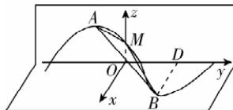

> [!faq]- 答案与解析
>
> > [!success]- **【答案】** ABD
>
> > [!note]- **【解析】**
> > ABD 【解析】在题图①中，由 $f(x)=\sin\left(\pi x+\frac{5\pi}{6}\right)$ ，得 $A\left(-\frac{1}{3},1\right)$ ， $B\left(\frac{2}{3},-1\right),D\left(\frac{2}{3},0\right),M\left(0,\frac{1}{2}\right)$ 在题图②中，建立如图所示的空间直角坐标系 Oxyz,
> >
> > 
> >
> > 则 $A\left(0, - \frac{1}{3},1\right),B\left(1,\frac{2}{3},0\right),$
> >
> > $M\left(0,0,\frac{1}{2}\right),D\left(0,\frac{2}{3},0\right)$ ，则 $\overrightarrow{AB}=(1,1,-1)$ ，则 $|\overrightarrow{AB}|=\sqrt{3}$ ，A 正确。
> > 设平面 ABM 的法向量为 $\boldsymbol{n}=(x,y,z)$ ，又 $\overrightarrow{AM}=\left(0,\frac{1}{3},-\frac{1}{2}\right)$ ，则 $\left\{\begin{aligned}&n\cdot\overrightarrow{AB}=0,\\ &n\cdot\overrightarrow{AM}=0,\end{aligned}\right.$ 即 $\left\{\begin{aligned}&x+y-z=0,\\&\frac{1}{3}y-\frac{1}{2}z=0,\end{aligned}\right.$ 取 y=3，则 z=2,x=-1，所以平面 ABM 的一个法向量为 $n=(-1,3,2)$ ，又 $\overrightarrow{DB}=(1,0,0)$ ，所以点 D 到平面 ABM 的距离为 $\frac{|\overrightarrow{DB}\cdot\boldsymbol{n}|}{|\boldsymbol{n}|}=\frac{1}{\sqrt{14}}=\frac{\sqrt{14}}{14}$ ，B 正确.
> > 取 $a = \overrightarrow{DB} = (1, 0, 0)$ , $u = \frac{\overrightarrow{AB}}{|\overrightarrow{AB}|} = \frac{\sqrt{3}}{3}(1,1,-1) = \left(\frac{\sqrt{3}}{3}, \frac{\sqrt{3}}{3}, -\frac{\sqrt{3}}{3}\right)$ ，则 $a^{2}=1,a\cdot u=\frac{\sqrt{3}}{3}$ ，所以点 D 到直线 AB 的距离为 $\sqrt{a^{2}-(a\cdot u)^{2}}=\frac{\sqrt{6}}{3}$ ，C 错误.
