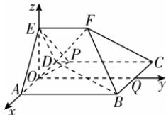

> [!faq]- 答案与解析
>
> > [!success]- **【答案】** (1)
>
> > [!note]- **【解析】**
> > 【证明】在 $\triangle EAD$ 中, $EA = ED$ , 且 $O$ 为 $AD$ 的中点, 所以 $EO \perp AD$ , 因为平面 $EAD \perp$ 平面 $ABCD$ , 平面 $EAD \cap$ 平面 $ABCD = AD$ , $EO \subset$ 平面 $EAD$ , 所以 $EO \perp$ 平面 $ABCD$ . 因为 $BD \subset$ 平面 $ABCD$ , 所以 $EO \perp BD$ . 在矩形 $ABCD$ 中, $\overrightarrow{DB} = \overrightarrow{DA} + \overrightarrow{DC}$ , $\overrightarrow{OP} = \overrightarrow{DP} - \overrightarrow{DO} = \frac{1}{8} \overrightarrow{DC} - \frac{1}{2} \overrightarrow{DA}$ , 由题意得 $|\overrightarrow{DC}| = 4$ , $|\overrightarrow{DA}| = 2$ , $DA \perp DC$ , 即 $\overrightarrow{DA} \cdot \overrightarrow{DC} = 0$ , 则 $\overrightarrow{DB} \cdot \overrightarrow{OP} = (\overrightarrow{DA} + \overrightarrow{DC}) \cdot \left( \frac{1}{8} \overrightarrow{DC} - \frac{1}{2} \overrightarrow{DA} \right) = \frac{1}{8} |\overrightarrow{DC}|^2 - \frac{1}{2} |\overrightarrow{DA}|^2 = 0$ , 所以 $BD \perp OP$ . 又因为 $EO \cap OP = O$ , $EO$ , $OP \subset$ 平面 $OEP$ , 所以 $BD \perp$ 平面 $OEP$ . (2)【解】在矩形 $ABCD$ 中, $AD // BC$ , 因为 $BC \not\subset$ 平面 $EAD$ , $AD \subset$ 平面 $EAD$ , 所以 $BC //$ 平面 $EAD$ , 因为 $BC \subset$ 平面 $FBC$ , 平面 $FBC \cap$ 平面 $EAD = m$ , 所以 $m // BC$ , 即 $AD // m$ , 因为 $m$ 与 $AE$ 的夹角为 $45^\circ$ , 所以$\angle EAD = 45^{\circ}$ ，又 $EA = ED$ ，所以 $\angle EDA =$ $\angle EAD = 45^{\circ}$ ，所以 $\angle AED = 90^{\circ}$ ，则 $AE\bot DE$ ，则 $EO = \frac{1}{2} AD = 1.$ 在矩形ABCD中， $AB / / CD$ ，因为 $AB\notin$ 平面CDEF, $CD\subset$ 平面CDEF，所以 $AB / /$ 平面CDEF，因为 $AB\subset$ 平面ABFE，平面ABFE∩平面CDEF=EF，所以 $AB / / EF.$ 取BC的中点为 $Q$ ，连接 $OQ$ ，由(1)知 $OE\bot AD,EO\bot$ 平面ABCD.又OA， $OQ\subset$ 平面ABCD，所以 $OE\bot OA,OE\bot$ $OQ$ ，又 $OA\bot OQ$ ，所以OE,OA,OQ两两垂直，由 $AB / / OQ$ ，可知 $EF / / OQ.$ 以 $O$ 为坐标原点， $OA,OQ,OE$ 所在直线分别为 $x,y,z$ 轴，建立空间直角坐标系，如图所示
> >
> > 
> >
> > 可得 $D(-1,0,0)$ , $B(1,4,0)$ , $F(0,2,1)$ , $C(-1,4,0)$ , 则 $\overrightarrow{DF}=(1,2,1)$ , $\overrightarrow{DB}=(2,4,0)$ , $\overrightarrow{CF}=(1,-2,1)$ , $\overrightarrow{CB}=(2,0,0)$ .
> > 设平面 BDF 的法向量为 $n = (x_{1}, y_{1}, z_{1})$ ，则 $\left\{\begin{aligned}\boldsymbol{n} & \cdot \overrightarrow{DF}=x_{1}+2y_{1}+z_{1}=0, \\ \boldsymbol{n} & \cdot \overrightarrow{DB}=2x_{1}+4y_{1}=0,\end{aligned}\right.$ 令 $y_{1}=1$ ，则 $x_{1}=-2, z_{1}=0$ ，即 $n=(-2,1,0)$ .
> > 设平面 BCF 的法向量为 $m = (x_{2}, y_{2}, z_{2})$ ，则 $\left\{\begin{aligned}\boldsymbol{m} & \cdot \overrightarrow{CF}=x_{2}-2y_{2}+z_{2}=0, \\ \boldsymbol{m} & \cdot \overrightarrow{CB}=2x_{2}=0,\end{aligned}\right.$ 得 $x_{2}=0$ ，令 $y_{2}=1$ ，则 $z_{2}=2$ ，即 $m=(0,1,2)$ .
> > 设二面角 D-BF-C 的大小为 $\theta$ ，由图可知二面角 D-BF-C 为锐角，则 $\cos\theta=\frac{|n\cdot m|}{|n||m|}=\frac{1}{5}.$ 故二面角 D-BF-C 的余弦值为 $\frac{1}{5}$ .
