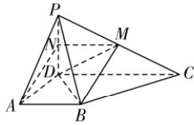
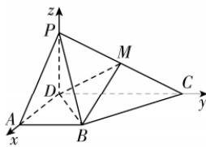

> [!faq]- 答案与解析
>
> > [!success]- **【答案】** (1)
>
> > [!note]- **【解析】**
> > 【证明】取 $PD$ 的中点 $N$ , 连接 $AN$ , 点悟: 有中点证平行, 找中位线 $MN$ , 如图①所示. $\because M$ 为棱 $PC$ 的中点, $\therefore MN \parallel CD, MN = \frac{1}{2} CD.$ $\because AB \parallel CD, AB = \frac{1}{2} CD, \therefore AB \parallel MN, AB = MN,$ $\therefore$ 四边形 $ABMN$ 是平行四边形, $\therefore BM \parallel AN$ , 又 $BM \not\subset$ 平面 $PAD, AN \subset$ 平面 $PAD, \therefore BM \parallel$ 平面 $PAD$ .
> >
> > 
> > 图①
> >
> > (2)【解】 $\because PC=\sqrt{5},PD=1,CD=2,$ $\therefore PC^{2}=PD^{2}+CD^{2},\therefore PD\perp CD.$ $\because$ 平面 $PDC \perp$ 平面 $ABCD$ , 平面 $PDC \cap$ 平面 $ABCD=CD,PD \subset$ 平面 $PDC$ , $\therefore PD \perp$ 平面 $ABCD.$ 又 $AD,CD \subset$ 平面 $ABCD,\therefore PD \perp AD,PD \perp CD$ , 而 $AD \perp CD,\therefore$ 以点 $D$ 为坐标原点, $DA,DC,DP$ 所在直线分别为 $x,y,z$ 轴建立如图②所示的空间直角坐标系, 则 $P(0,0,1)$ , $D(0,0,0),A(1,0,0),C(0,2,0)$ , $B(1,1,0)$ , $\because M$ 为棱 $PC$ 的中点, $\therefore M\left(0,1,\frac{1}{2}\right).$ (i) $\overrightarrow{DM}=\left(0,1,\frac{1}{2}\right),\overrightarrow{DB}=(1,1,0)$ , 设平面 $BDM$ 的法向量为 $n=(x,y,z)$ ,
> >
> > 则 $\begin{cases}\boldsymbol{n}\cdot\overrightarrow{DM}=y+\frac{1}{2}z=0,\\ \boldsymbol{n}\cdot\overrightarrow{DB}=x+y=0,\end{cases}$ 令 $z=2$ , 则 $y=-1,x=1,\therefore n=(1,-1,2)$ ,
> >
> > 易知平面 $PDM$ 的一个法向量为 $\overrightarrow{DA}=(1,0,0),\therefore \cos\langle\boldsymbol{n},\overrightarrow{DA}\rangle=\frac{\boldsymbol{n}\cdot\overrightarrow{DA}}{|\boldsymbol{n}||\overrightarrow{DA}|}=$ $\frac{1}{\sqrt{6}\times 1}=\frac{\sqrt{6}}{6}.$ 根据图形得二面角 $P-DM-B$ 为钝角, 则二面角 $P-DM-B$ 的余弦值为 $-\frac{\sqrt{6}}{6}.$ (ii) 假设在线段 $PA$ 上存在点 $Q$ , 使得点 $Q$ 到平面 $BDM$ 的距离是 $\frac{2\sqrt{6}}{9}$ ,
> >
> > 设 $\overrightarrow{PQ}=\lambda\overrightarrow{PA},0\leqslant\lambda\leqslant 1$ , 则 $Q(\lambda,0,1-\lambda),\overrightarrow{BQ}=(\lambda-1,-1,1-\lambda)$ ,
> >
> > 由 (2) 知平面 $BDM$ 的一个法向量为 $\boldsymbol{n}=(1,-1,2),\overrightarrow{BQ}\cdot\boldsymbol{n}=\lambda-1+1+2(1-\lambda)=2-\lambda,$ $\therefore$ 点 $Q$ 到平面 $BDM$ 的距离是 $\frac{|\overrightarrow{BQ}\cdot\boldsymbol{n}|}{|\boldsymbol{n}|}=\frac{2-\lambda}{\sqrt{6}}=\frac{2\sqrt{6}}{9},\therefore \lambda=\frac{2}{3},$ $\therefore PQ=\frac{2\sqrt{2}}{3}.$
> >
> > 
> > 图②
> >
> > ## 归纳总结 二面角的求法
> >
> > (1) 几何法: 找→作 (定义法、三垂线法、垂面法) → 证 (定义) → 求 (解三角形).
> > (2) 向量法: 首先求出两个半平面的法向量 m, n, 再代入公式 $\cos \alpha = \pm \frac{|m \cdot n|}{|m||n|}$ (其中 $\alpha$ 是二面角的大小) 求解 (注意通过观察二面角的大小选择“±”).
> >
> > ## 第 1.4 节综合训练
> >
> > ## 刷能力
