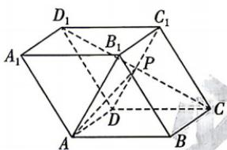

<!-- question-source:start -->
3.[广东中山纪念中学等校2025高二联考]如图,在平行六面体 $ABCD-A_{1}B_{1}C_{1}D_{1}$ 中,底面ABCD和侧面 $A_{1}ADD_{1}$ 都是正方形, $\angle BAA_{1}=\frac{2\pi}{3},AB=2$ ,点P是 $C_{1}D$ 与 $CD_{1}$ 的交点,则 $\overrightarrow{AP}\cdot\overrightarrow{AB_{1}}=$

A. $4 - 2\sqrt{3}$ B. 2 C. 4 D. 6
<!-- question-source:end -->
