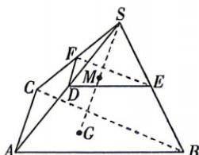

<!-- question-source:start -->
4.[江苏南通启东中学2026高二段考]如图,在三棱锥S-ABC中,点G为底面△ABC的重心,点M是线段SG的中点,过点M的平面分别交SA,SB,SC于点D,E,F,若 $\overrightarrow{SD}=k\overrightarrow{SA}$ , $\overrightarrow{SE}=m\overrightarrow{SB},\overrightarrow{SF}=n\overrightarrow{SC}$ ,则 $\frac{1}{k}+\frac{1}{m}+\frac{1}{n}=$ ( )

A. 3 B. 6 C. 9 D. 12

建议用时:120 分钟 答案 P124
<!-- question-source:end -->
