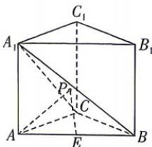

<!-- question-source:start -->
8. 如图, 在直三棱柱 $ABC - A_{1}B_{1}C_{1}$ 中, $\triangle ABC$ 是腰长为 1 的等腰直角三角形, 且 $AB > AC$ , 侧面 $ACC_{1}A_{1}$ 为正方

形, $\overrightarrow{AB}=2\overrightarrow{AE},P$ 为平面 $A_{1}BC$ 内一动点,则PA+PE的最小值是
( )
A. $\frac{\sqrt{6}}{2}$ B. $\frac{\sqrt{3}}{2}$ C. $\sqrt{5}$ D. $\frac{\sqrt{26}}{5}$

## 二、多项选择题: 本大题共 3 小题, 每小题 6 分, 共 18 分. 在每小题给出的选项中, 有多项符合题目要求. 全部选对的得 6 分, 部分选对的得部分分, 有选错的得 0 分.
<!-- question-source:end -->
