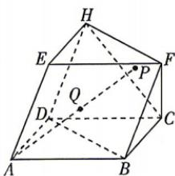

<!-- question-source:start -->
10. [河南郑州 2026 高二期中] 如图, 多面体 ABCD-EFH 是由各棱长均为 1 的平行六面体 ABCD-EFGH 截去三棱锥 G-CFH 后剩下的几何体, 若点 P 是 $\triangle CHF$ 的重心, $\angle EAB = \angle EAD = \angle DAB = 60^{\circ}$ , $\overrightarrow{AQ} = \lambda \overrightarrow{AP}$ , 则下列说法正确的是 ( )

A. $AP = \frac{8}{3}$ B.异面直线 $AP,CD$ 所成角的余弦值为 $\frac{\sqrt{6}}{3}$ C. $AP\bot BD$

D. 若 $E, Q, B, D$ 四点共面, 则点 $Q$ 是线段 $AP$ 的中点
<!-- question-source:end -->
