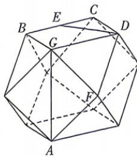

<!-- question-source:start -->
11.[山东省实验中学2025高二期中]立体几何中有很多立体图形都体现了数学的对称美,其中半正多面体是由两种或两种以上的正多

边形围成的多面体, 半正多面体因其最早由阿基米德研究发现, 故也被称作阿基米德多面体. 如图, 这是一个棱数为 24, 棱长为 $2\sqrt{2}$ 的半正多面体, 它所有顶点都在同一个正方体的表面上, 可以看成是由一个正方体截去八个一样的四面体所得到, 下列结论正确的有 ( )

A. $AG \perp$ 平面 $BCDG$ B. 该半正多面体的体积为 $\frac{160}{3}$ C. 点 $B$ 到平面 $ACD$ 的距离为 $\frac{\sqrt{6}}{3}$ D. 若 $E$ 为线段 $BC$ 上的动点 (包含 $B, C$ 两点), 则直线 $DE$ 与直线 $AF$ 所成角的余弦值的取值范围为 $\left[\frac{1}{2}, \frac{\sqrt{2}}{2}\right]$

## 三、填空题: 本大题共 3 小题, 每小题 5 分, 共 15 分.
<!-- question-source:end -->
