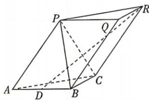

<!-- question-source:start -->
18.(本小题满分17分)[广东多校2026高二期中联考]如图,在三棱柱ABC-PQR中,点D为AB的中点,记 $\overrightarrow{AB}=a,\overrightarrow{AC}=b,\overrightarrow{AP}=c.$

(1)用 a, b, c 表示 $\overrightarrow{DR}$ ;

(2)若三棱锥 P-ABC 是棱长为 2 的正四面体, 求 $\left|\overrightarrow{DR}\right|$ ;

(3)若三棱锥 P-ABC 是正三棱锥,且异面直线 DR 与 AC 所成角的余弦值大于 $\frac{1}{2}$ , 求 $\cos\langle a,c\rangle$ 的取值范围.

<!-- question-source:end -->
