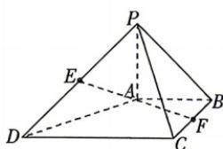
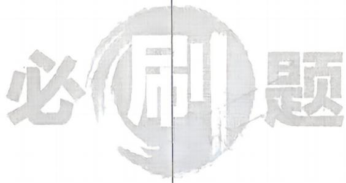

<!-- question-source:start -->
19. (本小题满分 17 分) [黑龙江哈尔滨 2025 高二期中] 如图, 在四棱锥 $P-ABCD$ 中, $PA \perp$ 平面 $ABCD$ , $AB \parallel CD$ , 且 $CD = 2$ , $AB = 1$ , $BC = 2\sqrt{2}$ , $PA = 1$ , $AB \perp BC$ , $E$ , $F$ 分别为 $PD$ , $BC$ 的中点.

(1) 求证: $EF \parallel$ 平面 PAB.

(2) 在线段 $PD$ 上是否存在一点 $M$ , 使得直线 $CM$ 与平面 $PBC$ 所成角的正弦值是 $\frac{1}{3}$ ? 若存在, 求出 $\frac{DM}{DP}$ 的值; 若不存在, 说明理由.

(3)在平面 $PBC$ 内是否存在点 $H$ , 满足 $\overrightarrow{HD} \cdot \overrightarrow{HA} = 0$ ? 若存在, 请写出点 $H$ 的轨迹图形形状; 若不存在, 请简单说明理由.

错题本
<!-- question-source:end -->
