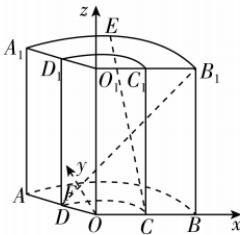

> [!faq]- 答案与解析
>
> > [!success]- **【答案】** B
>
> > [!note]- **【解析】**
> > B 【解析】设上底面所在圆的圆心为 $O_{1}$ ，下底面所在圆的圆心为 O，连接 $OO_{1}, O_{1}D_{1}, O_{1}C_{1}, OD, OC$ ，在下底面内过点 O 作 $OF \perp OC$ ，以 O 为原点，以 OC, OF, $OO_{1}$ 所在直线分别为 x 轴、y 轴、z 轴建立空间直角坐标系，如图所示.
> >
> > 
> >
> > 因为 $l_{1}=2l_{2}=\frac{4\pi}{3}$ ，所以弧长 $l_{2}, l_{1}$ 对应的两个圆的半径之比为 1:2，
> > 点悟：由扇形弧长公式 $l=\alpha R$ 可得
> > 即 $\frac{OD}{OA}=\frac{1}{2}$ ，由 AD=1，得 OD=1, OA=2， $\angle AOB=\frac{2\pi}{3}$ ，则 $D\left(\cos\frac{2\pi}{3},\sin\frac{2\pi}{3},0\right)$ ，即 $D\left(-\frac{1}{2},\frac{\sqrt{3}}{2},0\right)$ ， $E\left(2\cos\frac{\pi}{3},2\sin\frac{\pi}{3},3\right)$ ，即 E（1， $\sqrt{3},3$ ）。又 $C(1,0,0), B_{1}(2,0,3)$ ，则 $\overrightarrow{CE}=(0,\sqrt{3},3),\overrightarrow{DB_{1}}=\left(\frac{5}{2},-\frac{\sqrt{3}}{2},3\right)$ ，则 $|\overrightarrow{CE}|=\sqrt{3+9}=2\sqrt{3}$ ， $|\overrightarrow{DB_{1}}|=\sqrt{\frac{25}{4}+\frac{3}{4}+9}=4,\overrightarrow{CE}\cdot\overrightarrow{DB_{1}}=\frac{5}{2}\times0+\left(-\frac{\sqrt{3}}{2}\right)\times\sqrt{3}+3\times3=\frac{15}{2}$ ，所以 $\cos\langle\overrightarrow{CE},\overrightarrow{DB_{1}}\rangle=\frac{\overrightarrow{CE}\cdot\overrightarrow{DB_{1}}}{|\overrightarrow{CE}||\overrightarrow{DB_{1}}|}=$ $\frac{\frac{15}{2}}{2\sqrt{3}\times4}=\frac{5\sqrt{3}}{16}>0.$ 故异面直线 CE 与 $DB_{1}$ 所成角的余弦值为 $\frac{5\sqrt{3}}{16}$ .
> >
> > 故选 **B**.
