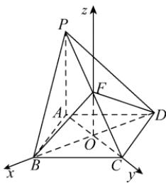

> [!faq]- 答案与解析
>
> > [!success]- **【答案】** D
>
> > [!note]- **【解析】**
> > D 【解析】如图, 设 BD 与 AC 交于点 O, 连接 OF. ∵ 四边形 ABCD 为菱形, ∴ O 为 AC 的中点, $AC \perp BD$ . ∵ F 为 PC 的中点, ∴ $OF \parallel PA$ . ∵ $PA \perp$ 平面 ABCD, ∴ $OF \perp$ 平面 ABCD. 以 O 为原点, OB, OC, OF 所在直线分别为 x 轴、y 轴、z 轴建立空间直角坐标系 Oxyz. 设 PA = AD = AC = 1, 则 $BD = \sqrt{3}$ ,
> >
> > 
> >
> > $\therefore B\left(\frac{\sqrt{3}}{2},0,0\right),F\left(0,0,\frac{1}{2}\right),C\left(0,\frac{1}{2},0\right),D\left(-\frac{\sqrt{3}}{2},0,0\right),\therefore \overrightarrow{OC} =$ $\left(0,\frac{1}{2},0\right)$ ，易知 $\overrightarrow{OC}$ 为平面 $BDF$ 的一个法向量.由 $\overrightarrow{BC} = \left(-\frac{\sqrt{3}}{2},\frac{1}{2},0\right),\overrightarrow{FB} =$ $\left(\frac{\sqrt{3}}{2},0, - \frac{1}{2}\right)$ ，可求得平面 $BCF$ 的一个法向量为 $\pmb {n} = (1,\sqrt{3},\sqrt{3})$ ： $\therefore \cos \langle \pmb {n},\overrightarrow{OC}\rangle = \frac{\sqrt{21}}{7},\therefore \sin \langle \pmb {n},\overrightarrow{OC}\rangle =$ $\frac{2\sqrt{7}}{7}$ 又二面角 $C - BF - D$ 为锐二面角，∴二面角 $C - BF - D$ 的正切值为 $\tan \langle \pmb {n},\overrightarrow{OC}\rangle = \frac{2\sqrt{3}}{3}.$
> >
> > 故选 **D**.
