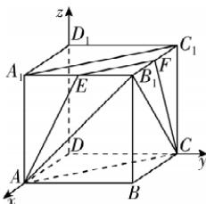

> [!faq]- 答案与解析
>
> > [!success]- **【答案】** D
>
> > [!note]- **【解析】**
> > D 【解析】如图，设平面 ACE 与棱 $B_{1}C_{1}$ 交于点 F，连接 EF, FC, $A_{1}C_{1}$ ，又平面 ABCD // 平面 $A_{1}B_{1}C_{1}D_{1}$ ，平面 $A_{1}B_{1}C_{1}D_{1} \cap$ 平面 AEC = EF，平面 ABCD ∩ 平面 AEC = AC，所以 AC // EF。又 $AC // A_{1}C_{1}$ ，所以 $EF // A_{1}C_{1}$ ，则 $EB_{1} = FB_{1}, A_{1}E = C_{1}F$ 。当 E 与 $B_{1}$ 重合时，截面为 $\triangle AB_{1}C, V_{B_{1}-ABC} = \frac{1}{3} \times \frac{1}{2} \times 1 \times 1 \times 1 = \frac{1}{6} = \frac{1}{6} V_{ABCD-A_{1}B_{1}C_{1}D_{1}}$ ，不符合题意。
> >
> > 同理，当 E 与 $A_{1}$ 重合，F 与 $C_{1}$ 重合时，也不符合题意。
> >
> > 如图，以点 D 为坐标原点，DA, DC, $DD_{1}$ 所在直线分别为 x, y, z 轴，建立空间直角坐标系，
> >
> > 设 $EB_{1} = a (0 < a < 1)$ ，则 $FB_{1} = a$ ，由题易
> >
> > → 点悟：已经排除 E 与 $A_{1}, B_{1}$ 重合的情况，故此处不取等号
> >
> > 知 A(1,0,0), C(0,1,0), $B_{1}(1,1,1)$ , E(1,1-a,1)，故 $\overrightarrow{EA} = (0, a - 1, -1), \overrightarrow{AB_{1}} = (0, 1, 1), \overrightarrow{CB_{1}} = (1, 0, 1)$ ，
> >
> > 所以三棱台 $EFB_{1} - ACB$ 的体积 $V_{EFB_{1}-ACB} = \frac{1}{3} \left( \frac{1}{2} a^{2} + \frac{1}{2} + \sqrt{\frac{1}{2} a^{2} \times \frac{1}{2}} \right) \times 1 = \frac{1}{4} V_{ABCD-A_{1}B_{1}C_{1}D_{1}}$ ，所
> >
> > 以 $\frac{1}{3} \left( \frac{1}{2} a^{2} + \frac{1}{2} + \sqrt{\frac{1}{2} a^{2} \times \frac{1}{2}} \right) \times 1 = \frac{1}{4}$ ，化简整理得 $2a^{2} + 2a - 1 = 0$ ，解得 $a = \frac{\sqrt{3} - 1}{2}$ 设平面 $AB_{1}C$ 的法向量为 n = (x, y, z)，则 $\left\{\begin{aligned}&n \cdot \overrightarrow{AB_{1}} = y + z = 0, \\ &n \cdot \overrightarrow{CB_{1}} = x + z = 0,\end{aligned}\right.$ 令 z = -1，则$n=(1,1,-1)$ ,
> > 所以点 E 到平面 $AB_{1}C$ 的距离 d = $\frac{|n\cdot\overrightarrow{EA}|}{|n|}=\frac{|a-1+1|}{\sqrt{3}}=\frac{a}{\sqrt{3}}=\frac{\sqrt{3}-1}{2\sqrt{3}}=$ $\frac{3-\sqrt{3}}{6}$ . 故选 D.
> >
> > 
