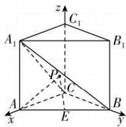

> [!faq]- 答案与解析
>
> > [!success]- **【答案】** A
>
> > [!note]- **【解析】**
> > A 【解析】由题意，以 C 为坐标原点，CA, CB, CC₁ 所在直线分别为 x, y, z 轴，建立如图所示的空间直角坐标系 Cxyz，则 A₁(1,0,1), B(0,1,0), C(0,0,0), A(1,0,0), E(½,½,0)，所以 $\overrightarrow{CB}=(0,1,0)$ , $\overrightarrow{CA_1}=(1,0,1)$ , $\overrightarrow{AA_1}=(0,0,1)$ ，设 A 关于平面 A₁BC 的对称点为 A'(x,y,z), z > 0，则 $\overrightarrow{A'A_1}=(1-x,-y)$ ，
> > - **③**：思：易知 AC₁ ⊥ 平面 A₁BC，且点 A 和点 C₁ 到平面 A₁BC 的距离相等，即 A 关于平面 A₁BC 的对称点为 C₁
> >
> > 1 - z), $\overrightarrow{AA'}=(x-1,y,z)$ .
> >
> > 设平面 A₁BC 的法向量为 n = (x₁, y₁, z₁)，则 $\left\{\begin{aligned}\overrightarrow{CB} \cdot \boldsymbol{n}&=0,\\ \overrightarrow{CA_1} \cdot \boldsymbol{n}&=0,\end{aligned}\right.$ 即 $\left\{\begin{aligned}y_1&=0,\\ x_1+z_1&=0,\end{aligned}\right.$ 令 x₁ = 1，则 y₁ = 0, z₁ = -1，所以 n = (1, 0, -1) 为平面 A₁BC 的一个法向量，所以 A 与 A' 到平面 A₁BC 的距离 d = $\frac{|\overrightarrow{AA_1} \cdot \boldsymbol{n}|}{|\boldsymbol{n}|}=\frac{\sqrt{2}}{2}=\frac{|\overrightarrow{A'A_1} \cdot \boldsymbol{n}|}{|\boldsymbol{n}|}=\frac{|-x+z|}{\sqrt{2}}$ ，即 $|-x+z|=1$ ①，又 $\overrightarrow{AA'}//n$ ，所以 $\left\{\begin{aligned}x-1&=-z,\\ y&=0\end{aligned}\right.$ ②，
> >
> > 所以由①②得 |2z-1|=1，又由 z>0 可得 x=0, y=0, z=1，所以 A'(0,0,1)，所以 PA+PE = PA' + PE ≥ A'E =
> > - **③**：悟：利用三角形中两边之和大于第三边得到 $\sqrt{\left(0-\frac{1}{2}\right)^2+\left(0-\frac{1}{2}\right)^2+(1-0)^2}=$ $\sqrt{\frac{1}{4}+\frac{1}{4}+1}=\frac{\sqrt{6}}{2}$ 当且仅当 A', P, E 三点共线时取等号，所以 PA+PE 的最小值为 $\frac{\sqrt{6}}{2}$ . 故选 A.
> >
> > 
