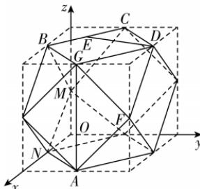

> [!faq]- 答案与解析
>
> > [!success]- **【答案】** ABD
>
> > [!note]- **【解析】**
> > ABD 【解析】题图中半正多面体是由如图所示的正方体截去八个全等的四面体得到的, 即该半正多面体的所有顶点都是正方体的棱的中点.
> >
> > 
> >
> > A 选项,由题意结合图形可知 $AG \perp$ 平面 $BCDG$ , A 正确;
> > B 选项,该半正多面体可看作由一个正方体截去八个全等的四面体所得,故其体积 $V = 4 \times 4 \times 4 - 8 \times \frac{1}{3} \times \frac{1}{2} \times 2 \times 2 \times 2 = \frac{160}{3}$ , B 正确;
> > C 选项,建立如图所示的空间直角坐标系,易知正方体的棱长为 4, $\therefore B(2,0,4)$ , $A(4,2,0)$ , $D(2,4,4)$ , $C(0,2,4)$ , $\therefore \overrightarrow{CD} = (2,2,0)$ , $\overrightarrow{CA} = (4,0,-4)$ , 设平面 $ACD$ 的法向量为 $\boldsymbol{n}_{1} = (x,y,z)$ , 则 $\left\{ \begin{array}{l} \overrightarrow{CD} \cdot \boldsymbol{n}_{1} = 2x + 2y = 0, \\ \overrightarrow{CA} \cdot \boldsymbol{n}_{1} = 4x - 4z = 0, \end{array} \right.$ 不妨令 $x = 1$ , 则 $y = -1, z = 1$ , 即 $\boldsymbol{n}_{1} = (1,-1,1)$ , $\overrightarrow{CB} = (2,-2,0)$ , $\therefore$ 点 $B$ 到平面 $ACD$ [125]的距离为 $\frac{|\overrightarrow{CB}\cdot n_{1}|}{|n_{1}|}=\frac{2+2}{\sqrt{3}}=\frac{4\sqrt{3}}{3}$ ，故C错误；
> > 设 $E(a,2-a,4),0 \leqslant a \leqslant 2, F(4,4,2), \therefore \overrightarrow{ED} = (2 - a, a + 2, 0), \overrightarrow{AF} = (0,2,2)$ 设直线 DE 与 AF 所成的角为 $\theta$ ，则 $\cos\theta=\left|\frac{\overrightarrow{ED}\cdot\overrightarrow{AF}}{|\overrightarrow{ED}||\overrightarrow{AF}||}\right|=$ $\frac{2a+4}{\sqrt{(2-a)^{2}+(a+2)^{2}}\times2\sqrt{2}}=\frac{a+2}{\sqrt{16+4a^{2}}}=\sqrt{\frac{a^{2}+4a+4}{16+4a^{2}}}$ 当 $a \neq 0$ 时，令 $f(a)=\frac{a^{2}+4a+4}{4a^{2}+16}=\frac{1}{4}+\frac{a}{a^{2}+4}=\frac{1}{4}+\frac{1}{a+\frac{4}{a}}$ $\because a+\frac{4}{a}\geqslant2\sqrt{a\cdot\frac{4}{a}}=4$ ，当且仅当 $a=\frac{4}{a}$ ，即 a=2 时取等号， $\therefore \frac{1}{4}<f(a)\leqslant\frac{1}{2}$ ，则 $\frac{1}{2}<\cos\theta\leqslant\frac{\sqrt{2}}{2}$ 当 a=0 时， $\cos\theta=\frac{1}{2}$ 道坑：易忽略 a=0 时的情况
> > ∴ 直线 DE 与直线 AF 所成角的余弦值的取值范围为 $\left[\frac{1}{2},\frac{\sqrt{2}}{2}\right]$ ，故 D 正确.
> >
> > 故选 **ABD**.
