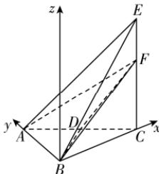

> [!faq]- 答案与解析
>
> > [!success]- **【答案】** $336\pi$
>
> > [!note]- **【解析】**
> > 因为平面 $ACE \perp$ 平面 ABC, $AC \perp CE$ , 且平面 $ACE \cap$ 平面 ABC = AC, $CE \subset$ 平面 ACE, 所以 $CE \perp$ 平面 ABC.
> >
> > 又 AB, BC ⊂ 平面 ABC, 所以 $CE \perp AB, CE \perp BC$ .
> >
> > 在 $\triangle ABC$ 中, 因为 AC = 2AB = 12, $\angle BAC = \frac{\pi}{3}$ , 所以由余弦定理得 BC = $\sqrt{AC^{2} + AB^{2} - 2AC \cdot AB\cos\frac{\pi}{3}} = \sqrt{12^{2} + 6^{2} - 2 \times 12 \times 6 \times \frac{1}{2}} = 6\sqrt{3}$ , 所以 $AC^{2} = AB^{2} + BC^{2}$ , $\angle ABC = \frac{\pi}{2}$ , 所以 $AB \perp BC$ .
> >
> > 以 B 为坐标原点, BC, BA 所在直线分别为 x 轴、y 轴, 过 B 且垂直于平面 ABC 的直线为 z 轴, 建立如图所示的空间直角坐标系.
> >
> > 
> >
> > 因为 AC = CE = 2AB = 12, D 为 AC 的中点，F 是 CE 上的一个动点，设 CF = m > 0，
> > 所以 B(0,0,0), A(0,6,0), C(6 $\sqrt{3}$ , 0,0), D(3 $\sqrt{3}$ , 3,0), F(6 $\sqrt{3}$ , 0,m). 设 $\triangle ABD$ 的重心为 O，则 $O(\sqrt{3}, 3, 0)$ ，设三棱锥 B-ADF 外接球的球心
> > → 点悟：利用三角形的重心坐标公式得到
> > 为 $O_{1}$ ，则 $O_{1}(\sqrt{3},3,n)$ ，
> > 则有 $BO_{1}=FO_{1}$ ，即 $\sqrt{(\sqrt{3})^{2}+3^{2}+n^{2}}=\sqrt{(5\sqrt{3})^{2}+(-3)^{2}+(m-n)^{2}}$ 则 $m^{2}-2mn+72=0$ ，所以 $n=\frac{m}{2}+\frac{36}{m}\geqslant2\sqrt{\frac{m}{2}\cdot\frac{36}{m}}=6\sqrt{2}$ ，当且仅当 $\frac{m}{2}=\frac{36}{m}$ ，即 $m=6\sqrt{2}$ 时等号成立. 设三棱锥 B-ADF 外接球半径为 R，表面积为 S，则 $S=4\pi R^{2}=4\pi(12+n^{2})$ ，则 $S_{\min}=4\pi\times\left[12+(6\sqrt{2})^{2}\right]=336\pi.$
