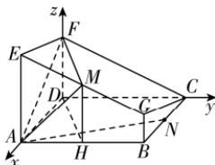

> [!faq]- 答案与解析
>
> > [!success]- **【答案】** (1)
>
> > [!note]- **【解析】**
> > 【证明】因为 AE, DF, BG 都垂直于平面 ABCD, 所以 $AE \parallel BG \parallel DF$ .
> > 取 AB 的中点 H, 连接 MH, DH, 则 $MH \parallel AE$ , 且 $MH = \frac{AE + BG}{2} = 2$ ,
> > 所以 $MH \parallel DF$ , 且 MH = DF, 所以四边形 DFMH 为平行四边形,
> > 所以 FM // DH, 且 FM ∉ 平面 ABCD, DH ⊂ 平面 ABCD, 所以 FM// 平面 ABCD.
> > (2)【解】连接 AN. 以 D 为坐标原点, DA, DC, DF 所在直线分别为 x, y, z 轴, 建立如图所示的空间直角坐标系,
> >
> > 
> >
> > 则 $A(2,0,0)$ , $F(0,0,2)$ , $M(2,1,2)$ , $N(1,2,0)$ ,
> > 可得 $\overrightarrow{AN}=(-1,2,0)$ , $\overrightarrow{AM}=(0,1,2)$ , $\overrightarrow{AF}=(-2,0,2)$ .
> > 设平面 AMF 的法向量为 $n=(x,y,z)$ ，则 $\left\{\begin{aligned}\overrightarrow{AM}\cdot n=y+2z=0,\\ \overrightarrow{AF}\cdot n=-2x+2z=0,\end{aligned}\right.$ 取 x=1，得 y=-2, z=1，则 $n=(1,-2,1)$ .
> > 故点 N 到平面 AMF 的距离 d = $\frac{|\overrightarrow{AN}\cdot n|}{|n|}=\frac{|-1-4+0|}{\sqrt{6}}=\frac{5\sqrt{6}}{6}.$
