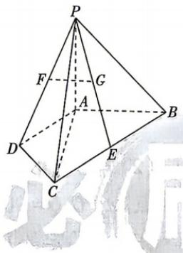

<!-- question-source:start -->
2.[北京 2025·17,14 分]如图,在四棱锥 P-ABCD 中, $\triangle ADC$ 与 $\triangle BAC$ 均为等腰直角三角形, $\angle ADC=90^{\circ},\angle BAC=90^{\circ},E$ 为 BC 的中点.
(1) 若 F, G 分别为 PD, PE 的中点, 求证: FG//平面 PAB;
(2) 若 PA⊥平面 ABCD, PA = AC, 求直线 AB 与平面 PCD 所成角的正弦值.

√ 答案 P128
<!-- question-source:end -->
